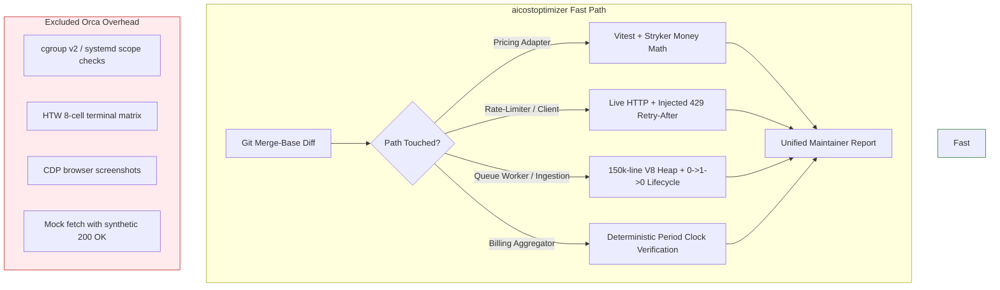

# Behavioral Verification Profile: aicostoptimizer

**Profile ID:** `aicostoptimizer`  
**Target Domain:** Cloud cost telemetry, API billing meters, rate-limit (429) mitigation, V8 memory bounds, queue worker processing.  
**Evaluation Standard:** Deterministic money invariants, fault-injected live HTTP semantics, and mutation-verified rate/price calculation.

---

## 1. Domain Assessment: Will This Method Help?

### The Honest Answer

**YES on the join.** The behavioral verification methodology provides massive value when scoped strictly to:
1. **Blast-radius freeze:** Isolating changes across pricing adapters, rate-limit controllers, ledger ingestion queues, and batch aggregators.
2. **Layer 1 (Targeted Vitest):** Verifying existing test coverage against changes.
3. **Layer 2 (Stryker / Mutation on Money Math):** Running mutation testing *exclusively* on financial and rate math (pricing calculation, token unit conversion, tiered thresholding, discount rounding).
4. **Layer 3 (Live Fault Injection):** Live HTTP runs with real injected 429 (`Retry-After`), socket drops, and latency—**never** mocked `fetch` wrappers that always resolve 200 OK.

**NO on kernel and visual apparatus.** If we force Orca-specific cgroup v2 hierarchical limits, systemd PID 1 scopes, or Headless Terminal Wrapper (HTW) 8-cell layout probes onto `aicostoptimizer`, it is pure dead weight and negative-value overhead.

### Domain Fit Matrix

| Verification Technique | Applicable to aicostoptimizer? | Rationale |
|:---|:---:|:---|
| **Merge-base blast radius** | **YES** | Ensures changes to pricing models don't secretly invalidate historical billing adapters. |
| **Mutation Testing (Stryker)** | **YES (Scoped)** | Critical for money math. A surviving mutant in tax or tier calculation is a real production billing bug. |
| **Fault Injection (HTTP 429 / Drops)** | **YES** | Proves retry exponential backoff, jitter, and idempotency keys behave under upstream pressure. |
| **V8 Heap & Worker Lifecycle (0→1→0)** | **YES** | Large invoice ingestion (150k+ lines) must not leak buffers or retain uncollected worker handles. |
| **Clock Mocking / Freezing** | **YES** | Billing periods and prorations require deterministic timestamps across timezone boundaries. |
| **cgroup v2 / systemd PID 1 checks** | **NO** | Cost optimizer runs in Node/serverless/cloud runtimes; cgroup hierarchy validation is irrelevant noise. |
| **HTW 8-cell terminal layouts** | **NO** | No terminal UI components; visual terminal cell assertions provide zero verification value. |
| **Renderer CDP Screenshots** | **NO** | Pure backend/worker/data ingestion pipeline. No Electron or browser renderer DOM to capture. |

---

## 2. Invariants of an Outstanding Cost Engine

An outstanding cost optimization and metering product requires five strict non-negotiable invariants:



1. **Deterministic Money Invariants:**
   - **Never overcharge:** Currency calculations must use integer micros/cents or fixed-point decicents; floating point math (`0.1 + 0.2 !== 0.3`) is strictly prohibited.
   - **Never drop a billable event:** Ingestion streams must be at-least-once with deterministic deduplication IDs.
   - **Fail closed on unknown rates:** If a model SKU or region price lookup is missing, the transaction must fail closed into a dead-letter queue (DLQ) rather than defaulting to `$0.00`.

2. **Idempotent Retries Under Upstream 429:**
   - Upstream rate limits (`429 Too Many Requests`) returning `Retry-After: N` must halt subsequent requests, respect the duration, and inject jitter.
   - Duplicate delivery of webhooks or ledger batches must yield exactly one database row without balance inflation.

3. **Bounded V8 Memory on Large Payloads:**
   - Parsing a 150,000-line cloud billing CSV/JSON export must process in streaming fashion.
   - Heap footprint must remain flat ($O(1)$ or small bounded buffer), never buffering the full unparsed payload in V8 heap memory.

4. **Resource Leak Invariant ($0 \to 1 \to 0$):**
   - Active queue workers, background timers, database pools, and Redis subscriber handles must cleanly tear down on task completion or SIGTERM. No dangling event-loop handles.

5. **Deterministic Clock for Billing Periods:**
   - Monthly and hourly proration calculations must run against an injectable, frozen clock to prevent midnight rollover race conditions or leap second drift.

---

## 3. Behavioral Script Specifications & Scenarios

| Scenario | Trigger / Input | Injected Condition | Expected Observable Behavior | Violation Assertion |
|:---|:---|:---|:---|:---|
| **Upstream 429 Throttle** | Provider API client request | Injected `HTTP 429` with `Retry-After: 3` | Exactly 1 retry attempt dispatched at $T + 3.0\text{s} \pm 200\text{ms}$; caller thread not blocked. | Request retried immediately (<3s) OR >1 retry sent OR request dropped silently. |
| **Duplicate Webhook Ingestion** | Stripe/AWS billing invoice event | Two identical events with same `idempotency_key` delivered concurrently | Exactly 1 ledger entry written; secondary event returns `200 OK` with `duplicate: true`. | Two ledger entries created; customer balance debited twice; or 500 error raised. |
| **Missing Pricing SKU** | Cost calculation for unlisted model (e.g. `claude-3-7-ultra-preview`) | Catalog lookup returns `null` | Throws `UnpricedSKUException`, diverts record to DLQ; does **not** price as `$0.00`. | Computed cost is `$0.00`, or raw unhandled null pointer crashes worker. |
| **150k Line Invoice Stream** | 250MB cloud bill ingestion | Ingest 150k line AWS CUR CSV stream | RSS memory delta $< 45\text{MB}$; V8 heap baseline restores to within 5% post-GC. | Heap usage climbs linearly with file size; process OOM crashes under 512MB limit. |
| **Worker Queue Drain** | Queue worker process lifecycle | Worker spawns, processes 50 billing jobs, receives shutdown signal | Active worker handles: $0 \to 1 \to 0$. No active Redis connections or timer handles remain in `wt.dump()`. | Unclosed DB connection pool or dangling interval keeps Node process alive after queue drain. |

---

## 4. Integration with Existing Tooling

`bverify` routes standard toolchains into the behavioral verification pipeline:

- **Vitest:** Executes targeted unit and integration suites based on git merge-base diff analysis.
- **Stryker:** Runs mutation testing targeted exclusively at `src/pricing/`, `src/math/`, and `src/ledger/`. A surviving mutant in currency math fails the verification run.
- **WireMock / LocalStack / In-Process Proxy:** Stood up via test containers or ephemeral child processes to simulate real vendor endpoints (AWS Cost Explorer, GCP Cloud Billing, OpenAI API, Stripe) with realistic packet drops, latency, and 429 responses.

---

## 5. What Makes Domain Experts Adopt It?

1. **Sub-60s Verification on Pricing Adapter Changes:**
   A developer editing an AWS Bedrock or OpenAI pricing adapter gets immediate merge-base blast radius calculations, runs 12 targeted unit tests, and executes a Stryker pass on the modified pricing math file in $< 45\text{s}$.
2. **Surviving Mutants Mean Real Price Discrepancies:**
   Rather than arbitrary mutation noise across logging strings, Stryker is tuned to arithmetic operators (`*`, `/`, `+`, `-`), comparisons (`>`, `>=`), and rounding (`Math.floor` vs `Math.round`). A surviving mutant indicates an untested discount boundary or tier rollover bug that would have billed real users improperly.
3. **Reproducible Live 429 Verification Without Real Provider Keys:**
   Developers can test production-grade backoff and circuit-breaking locally against injected HTTP fault servers without burning actual API tokens or waiting for real rate-limit resets.

---

## 6. Profile Configuration: `.bverify.yaml`

```yaml
version: "1.0"
profile: "aicostoptimizer"
description: "Behavioral verification profile for cloud cost optimization, metering, and 429 rate-limiting"

# Merge-base diff calculation
diff:
  base_branch: "origin/main"
  include_paths:
    - "src/pricing/**"
    - "src/metering/**"
    - "src/workers/**"
    - "src/adapters/**"
    - "src/ledger/**"
  exclude_paths:
    - "docs/**"
    - "*.md"
    - "scripts/**"

# Targeted Test Specifications
specs:
  unit:
    runner: "vitest"
    command: "npx vitest run --reporter=json"
    target_pattern: "test/**/*.spec.ts"
  
  # Layer 2: Mutation testing on financial math
  mutation:
    runner: "stryker"
    command: "npx stryker run"
    scoped_paths:
      - "src/pricing/**/*.ts"
      - "src/ledger/**/*.ts"
    reporters:
      - "clear-text"
      - "json"
    thresholds:
      high: 90
      low: 80
      break: 85 # Break build if money math mutation score drops below 85%

# Layer 3: Live Fault & HTTP Invariants
fault_injection:
  http:
    mock_server: "wiremock" # or local proxy
    scenarios:
      - name: "upstream-rate-limit-429"
        status: 429
        headers:
          Retry-After: "3"
        attempts_before_200: 1
        expected_client_attempts: 2
      - name: "upstream-timeout-socket-hangup"
        fault: "CONNECTION_RESET_BY_PEER"
        expected_fallback: "CIRCUIT_BREAKER_OPEN"

# Worker and Memory Invariants
invariants:
  lifecycle:
    verify_handles_0_1_0: true
    signal: "SIGTERM"
    timeout_ms: 5000
  memory:
    max_heap_mb: 256
    benchmark_stream_lines: 150000

# Explicit Non-Goals / Disabled Orca Probes
probes:
  cgroups_v2: false
  systemd_scopes: false
  htw_terminal_matrix: false
  renderer_cdp_capture: false
```
