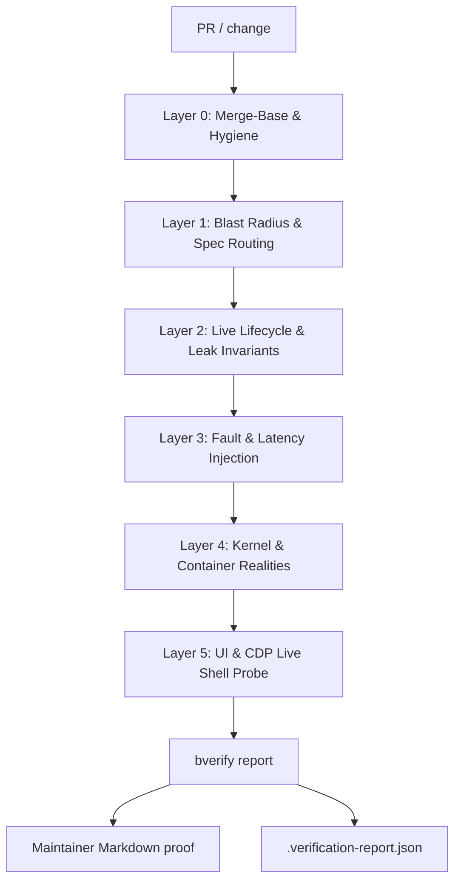
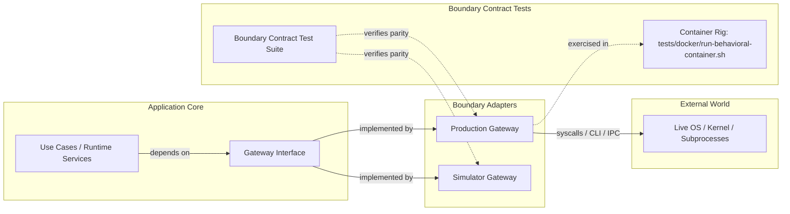
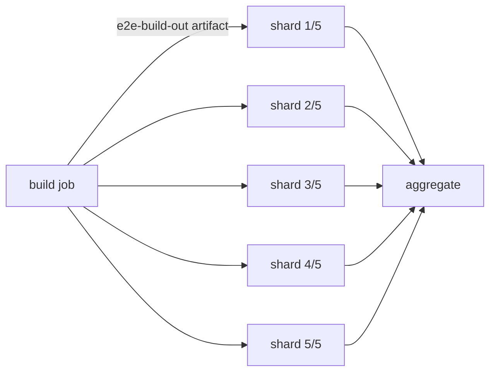
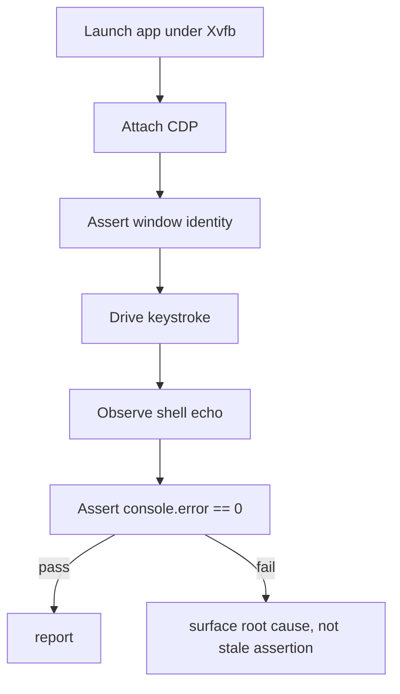
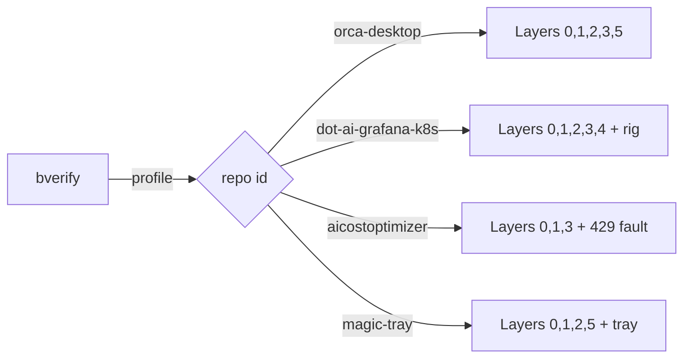
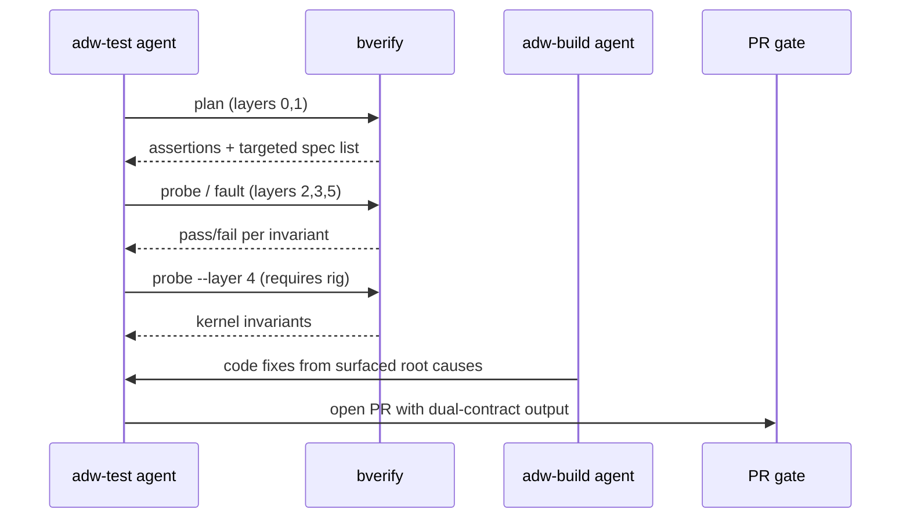
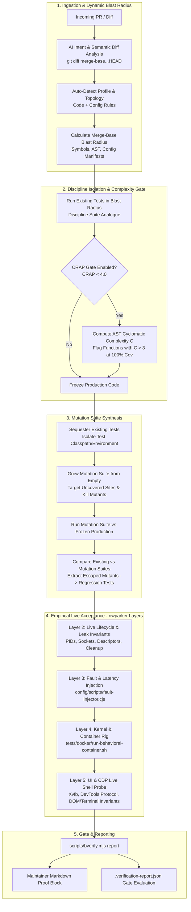

# Behavioral Verification Architecture

**Authoritative design reference for the Adversarial Empirical Behavioral Verification Agent Toolset & Containerized Runtime Rig (the "nwparker Standard").**

> Status: Proposed. This document specifies a verification methodology and toolset,
> not yet every shipped component. Claims tied to a specific PR cite that PR; the
> five-layer framework is the normative contract that `bverify` encodes.

---

## 1. Background & Executive Summary

### 1.1 The problem

Traditional CI unit tests with mocks are structurally blind to the class of
regressions that have repeatedly shipped into production runtimes. A mocked IPC
channel never holds a socket open; a flat container never exercises a real
cgroup hierarchy; an in-memory filesystem never delays a `readdir` across a
timeout boundary. The maintainer's empirical method — most clearly visible in
PRs [#19314](https://github.com/stablyai/orca/pull/19314),
[#19430](https://github.com/stablyai/orca/pull/19430),
[#18790](https://github.com/stablyai/orca/pull/18790),
[#10612](https://github.com/stablyai/orca/pull/10612),
[#16829](https://github.com/stablyai/orca/pull/16829),
[#3737](https://github.com/stablyai/orca/pull/3737),
[#3739](https://github.com/stablyai/orca/pull/3739),
[#3742](https://github.com/stablyai/orca/pull/3742), and
[#3697](https://github.com/stablyai/orca/pull/3697) — is that **test failures
expose real bugs, not stale assertions**. Every one of those PRs began as a
failing probe against a *live* runtime, then became a regression test only after
the root cause was fixed in source.

The failures share four common causes that mocks erase:

1. **Flat containers** collapse a real process tree, a real PID namespace, and
   real exit semantics into a single in-process harness. A zombie PTY, a leaked
   child, or a handle re-attached after teardown is invisible.
2. **Mocked IPC** never wedges, never reorders delivery, never holds a socket
   past its TTL. Production channels do all three.
3. **Absence of real cgroups/systemd** means `pids.max`, `KillMode=mixed`, and
   `systemd-run --user --scope` semantics are simulated rather than observed.
4. **Instant file I/O** means a `readdir` that should take 3.5 s under
   adversarial load always completes in microseconds, so timeout paths never run.

### 1.2 The answer

The nwparker Standard replaces "does this unit pass?" with "does the *behavior*
hold under a real runtime, an injected fault, and a leak invariant?" It is
organized as **five layers**, each closing one of the four gaps above, plus a
**containerized runtime rig** (Docker and Devbox) that makes the kernel-level
layers reproducible on any host, and an **agent CLI** (`bverify`) that turns
the layers into runnable verbs.



Each layer is adversarially framed: it *assumes* the runtime is trying to leak,
wedge, or time out, and asserts the invariant that says it didn't.

### 1.3 Clean Boundaries: Don't Mock What You Don't Own

In Uncle Bob's Clean Architecture, architecture is about boundaries. A core failure mode of legacy test suites is mock coupling: tests mock third-party drivers, native binaries, kernel interfaces, and IPC sockets directly inside business logic tests. When the real external boundary behaves differently (e.g. socket backpressure, signal propagation, cgroup hierarchies, or file descriptor reuse), the unit tests pass while production fails.

The nwparker Standard enforces the Clean Architecture boundary rule: **Never mock what you don't own.**



1. **Gateways and Simulators vs. Brittle Global Mocking:**
   - Application code must never import external drivers directly into core orchestration logic. All external interactions (process table inspection, terminal spawning, PTY allocation, worktree scanning, cgroup queries) must cross an explicit boundary defined by a **Gateway interface**.
   - For fast in-memory execution, tests employ **Simulators** (clean, high-fidelity in-memory fake implementations of the Gateway interface) rather than brittle dynamic monkey-patching (`vi.spyOn`, global prototype patching, or ad-hoc mock objects).
   - Simulators model realistic state transitions, latency delays, and error modes rather than echoing static pre-programmed return values.

2. **Boundary Contract Tests in Real Container Environments:**
   - A Simulator is only as good as its fidelity to reality. To prevent simulators and live adapters from drifting, the standard specifies **Boundary Contract Tests**.
   - A shared contract test suite exercises the Gateway interface against *both* the Simulator implementation and the live Production Gateway adapter.
   - Production Gateway contract tests run inside hermetic container environments (specifically `tests/docker/run-behavioral-container.sh`), guaranteeing that the live gateway interacts accurately with genuine Linux kernel primitives, systemd scopes, cgroups v2, and POSIX signal semantics.

### 1.4 F.I.R.S.T. Principles in Behavioral Verification

Uncle Bob's F.I.R.S.T. testing craftsmanship principles (Fast, Independent, Repeatable, Self-Validating, Timely) map directly to the empirical behavioral verification standard:

| Principle | Legacy Test Suite Failure | Behavioral Verification Standard Implementation |
| :--- | :--- | :--- |
| **Fast** | Slow full recompilation on every test shard; suite takes 20+ minutes in CI. | **Build Once, Shard with `SKIP_BUILD=1`:** The runtime artifact is built once upfront (`e2e-build-out`) and distributed across parallel execution shards. Shards invoke `pnpm run test:e2e` with `SKIP_BUILD=1`, decoupling verification execution from compilation latency. |
| **Independent** | Tests pollute shared config directories, leftover sockets, or stray child processes that contaminate subsequent runs. | **Ephemeral `mkdtemp` Profiles & Zero State Leak:** Every behavioral run provisions an isolated, transient filesystem profile via `mkdtemp` (`/tmp/orca-test-XXXXXX`). Sockets, logs, DBs, and PTYs bind strictly within this tree. Teardown validates $0 \to 1 \to 0$ resource invariants, preventing cross-test pollution. |
| **Repeatable** | "Works on my machine" due to host distro, installed system packages, cgroup v1/v2 mismatches, or systemd absence. | **Hermetic Container & Devbox Definitions:** Layer 4/kernel probes run within identical container topologies (`Dockerfile.serve-logging-test` driven by `tests/docker/run-behavioral-container.sh`) with systemd as PID 1 and unified cgroup v2 mounts, or via pure Devbox Nix shells (`devbox shellenv --pure`). |
| **Self-Validating** | Flaky subjective heuristics (e.g., `sleep(500)` and check if UI updated; checking loosely if process exists). | **Strict Numeric Invariants:** Binary pass/fail criteria governed by exact numbers: 0 leaked PTYs, 0 orphan child processes (`pgrep -P <pid>` is empty), 0 console errors (`consoleErrors.length === 0`), and exact state deltas. No fuzzy tolerance thresholds. |
| **Timely** | Tests written as an afterthought to satisfy code coverage metrics, retrofitting assertions to match broken code. | **Behavioral Probe Written Before Code:** Following the maintainer standard (PRs #19314, #19430, #18790, #16829), an empirical probe reproducing the failure against the live runtime is authored *first*. The probe fails, diagnosing the real defect; then source code is fixed until the probe passes. |

---

## 2. The 5-Layer Behavioral Verification Framework

### Layer 0 — Merge-Base & Architectural Hygiene

Layer 0 is architectural triage performed *before* behavioral probing. Its job
is to reject changes whose shape is wrong regardless of how well they run, and
to establish the clean baseline that higher layers diff against.

**Merge-base diffing.** Every probe starts from `git merge-base`, never from
HEAD alone, so the blast radius calculation (Layer 1) and the resurrection
checks below agree on what "changed":

```bash
git diff --name-only --diff-filter=ACMR --merge-base "$BASE" "$HEAD"
```

**Deleted-store resurrection detection.** A deleted persistence store (SQLite,
an IPC state file, a localStorage DB) must never silently come back to life
because a stale in-memory handle still holds a reference to its path. The
hygiene check asserts that teardown both (a) removes the file and (b) closes the
handle, so a subsequent open cannot resurrect deleted bytes:

```text
invariant: after teardown, open(path) MUST fail with ENOENT, not return a
stale inode via a still-live fd.
```

**Style-guide invariants.** Static, mechanical, and independently checkable.
They are the cheapest layer and therefore the first gate. Examples:

- No hardcoded hex color in renderer code (must be a `main.css` token).
- Native process queries only via the sanctioned snapshot module
  (`src/main/windows/windows-process-table.ts`), never a forked
  `Get-CimInstance Win32_Process`.

```bash
bverify plan --layer 0        # emits hygiene assertions; zero code executes
```

### Layer 1 — Dynamic Blast Radius & Targeted Spec Routing

Layer 1 answers "given this diff, which specs *must* run?" It exists to keep PR
latency bounded while never letting a changed code path escape untested.

**Merge-base diffing for spec routing.** Only specs that reference a changed
file run. The contract (encoded today in `.github/workflows/pr.yml` and
`.github/workflows/e2e.yml`) is:

1. Diff `HEAD` against merge-base, filtering `tests/e2e/.*\.spec\.ts$`.
2. Encode the surviving set into a JSON array.
3. Pass it as the `test_files` input to the E2E workflow's `changed-e2e` job.

```yaml
# .github/workflows/pr.yml (excerpt)
- id: changed-e2e
  name: Detect changed E2E specs
  run: |
    BASE="$(git merge-base origin/main HEAD)"
    FILES="$(git diff --name-only --diff-filter=ACMR --merge-base "$BASE" HEAD \
      | grep '^tests/e2e/.*\.spec\.ts$' | jq -R -s -c 'split("\n")[:-1]')"
    echo "test_files=$FILES" >> "$GITHUB_OUTPUT"
```

**Sharded dispatch.** When the full matrix runs (scheduled/release), the app is
built once, uploaded as an artifact (`e2e-build-out`), and reused across five
parallel shards with `SKIP_BUILD=1`, avoiding both recompilation waste and
PR-latency spikes:

```bash
xvfb-run --auto-servernum env SKIP_BUILD=1 ORCA_E2E_FORWARD_APP_LOGS=1 \
  pnpm run test:e2e "${TEST_FILES[@]}" --workers=1
```



> Design rule: the **blast radius is the spec list**, never "all specs." A spec
> that does not touch a changed file is not allowed to be the sole thing that
> fails — if it does, that is a discovery about spec coupling, recorded as such,
> not silently broadened.

### Layer 2 — Live Runtime Lifecycle & Leak Invariants

Layer 2 is where mocks are banned. Every assertion runs against a *real*
spawned process tree and asserts a **$0 \to 1 \to 0$ resource transition**:
the resource count starts at zero, becomes one (or N) during the operation, and
returns to zero when the operation completes and teardown runs.

**Resource transitions.** The canonical invariants:

| Resource | $0 \to 1 \to 0$ assertion |
| -------- | -------------------------- |
| Child processes | `pgrep -P <pid>` is empty after teardown |
| PTY zombies | no `pts/` entry lingers with state `Z` |
| Open handles | `lsof +E` / `/proc/<pid>/fd` count returns to baseline |
| Sockets | listening socket closes, `ESTABLISHED` count returns to zero |
| File descriptors | `/proc/self/fd` refcount on the deleted store returns to 0 |

**PTY zombie prevention.** The empirical root cause behind the "tree survived
its own teardown" class of bug (#9045, and the cold-parking race fixed via
deterministic activation ordering in `terminal-tab-activation-order.ts`) is
that teardown quitting a shell process is *not* sufficient when the PTY master
or a grandchild holds a live fd. The invariant is therefore asserted at the
tree level, not the process level:

```text
invariant: teardown(pty) -> tree(pty) is empty AND no zombie state Z remains.
```

**Handle re-attachment.** When a child is killed and re-created quickly, a stale
parent-side handle must not re-attach to the *new* inode. The probe opens,
closes, and reopens a store in a tight loop and asserts the handle identity is
stable (same fd → same inode, new inode → new fd):

```text
invariant: handle.identity does not outlive its inode; a re-open after
delete+recreate MUST bind to the new inode, never the resurrected one.
```

```bash
bverify probe --layer 2      # spawns real trees, asserts 0->1->0
```

### Layer 3 — Fault & Latency Injection

Layer 3 deliberately breaks timing assumptions. It injects *slowness, wedges,
and rate limits* and asserts the runtime's timeout / retry / reconciliation
behavior does the right thing — neither panicking too early nor hanging forever.

**Delayed `readdir` crossing the 3.5 s timeout.** The direct lay-read of the
worktree scan is made adversarial by delaying directory enumeration past the
consumer's 3.5 s deadline and asserting the consumer fails fast, retries, or
degrades *exactly* as specified — not by returning an empty directory (an empty
result is a false "nothing exists" claim, the same collapse that #9045 warns
against):

```text
inject: readdir latency = 3.6s (> 3.5s deadline)
assert: consumer surfaces timeout, does NOT emit empty dir, does NOT hang.
```

**30 s TTL vs 5 m reconciliation ceiling.** A cache entry with a 30 s TTL must
not be allowed to defer a reconciler whose ceiling is 5 m. The probe advances a
fake clock and asserts the two clocks compose: short-lived cache entries expire
first, and the reconciler's ceiling is never silently reset by a cache hit.

### 2.1 Executable State-Transition Specifications

Empirical verification requires behavioral specifications to be fully executable and deterministic. Instead of vague textual descriptions, state machines and cache boundaries are specified via unambiguous tabular state transitions:

#### Tabular Resource Lifecycle Transitions ($0 \to 1 \to 0$)

| Step | Action / Event | Resource State | Expected Delta | Post-Condition Assertion |
| :--- | :--- | :--- | :--- | :--- |
| 1. Baseline | System idle before test initialization | Baseline ($0$) | $0$ | Baseline resource snapshot recorded; 0 lingering processes/descriptors |
| 2. Allocation | Spawn child process / open PTY / bind socket | Active ($1 \dots N$) | $+1$ per allocated unit | Descriptors exist in `/proc/<pid>/fd`; `pts/` allocated; socket `LISTEN` |
| 3. Workload | Execute adversarial command or fault workload | Active ($1 \dots N$) | $0$ (net) | Operation succeeds or times out gracefully; no unmanaged spawned orphans |
| 4. Teardown | Trigger cleanup / session quit / unit kill | Terminating | $-N$ | SIGTERM / SIGKILL dispatched; sockets closed; PID exited |
| 5. Residual Gate | Final resource leak invariant check | Cleared ($0$) | Net $\Delta = 0$ | Exact return to baseline ($0$): `pgrep -P` empty, no `Z` (zombies), fds closed |

#### Worktree Scan Cache Age vs. Probe Status vs. Expected Scan Count

The table below specifies the executable transition matrix governing the interaction between cache TTL, fingerprint probe timeouts (Layer 3 `readdir-latency`), and forced reconciliation:

| Elapsed Time / Cache Age | Fingerprint Probe Status | Injected Fault / Latency | Expected Action | Worktree Scan Count Delta | Cumulative Scans |
| :--- | :--- | :--- | :--- | :--- | :--- |
| $0\text{ s}$ | Valid (`fp-0`) | None | Initial scan executed and cached | $+1$ | $1$ |
| $15\text{ s}$ ($< 30\text{ s}$ TTL) | Not queried | None | Cache hit; return cached rows | $0$ | $1$ |
| $31\text{ s}$ ($> 30\text{ s}$ TTL) | Returns match (`fp-0`) | Fast ($< 3.5\text{ s}$) | Fingerprint matches; cache refreshed without full scan | $0$ | $1$ |
| $65\text{ s}$ ($> 30\text{ s}$ TTL) | Returns new (`fp-1`) | Fast ($< 3.5\text{ s}$) | Fingerprint mismatch; execute full uncached scan | $+1$ | $2$ |
| $120\text{ s}$ ($> 30\text{ s}$ TTL) | Probe times out ($> 3.5\text{ s}$) | Injected $3.6\text{ s}$ latency via `fault-injector.cjs` | Probe timed out; fallback to uncached scan | $+1$ | $3$ |
| $150\text{ s}$ ($< 30\text{ s}$ from last scan) | Not queried | None | Cache hit; return cached rows | $0$ | $3$ |
| $301\text{ s}$ ($> 5\text{ m}$ reconcile) | Returns match (`fp-1`) | None | Cache age $\ge 5\text{ m}$; forced reconciliation scan triggered | $+1$ | $4$ |

#### Non-Invasive Fault Injection Hook (`config/scripts/fault-injector.cjs`)

To verify timeout, retry, and degraded behavior without altering production code or relying on brittle runtime monkey-patching, faults are injected at the node process boundary using `config/scripts/fault-injector.cjs` via `NODE_OPTIONS="--require ./config/scripts/fault-injector.cjs"`. The hook intercepts Node.js filesystem, socket, or child process operations externally based on declarative environment variables (e.g., `FAULT_READDIR_DELAY_MS=3600`, `FAULT_SOCKET_WEDGE=1`).


**Wedged sockets.** A socket that accepts and then stops reading must not wedge
a caller without a timeout. The probe opens a server, accepts a connection, and
never writes; the client must hit its deadline and close.

**Rate limits / 429 backoff.** For cloud-facing profiles (Section 3), the probe
injects HTTP 429 and asserts exponential backoff with a bounded retry count and
correct handling of the `Retry-After` header.

```bash
bverify fault --layer 3 --scenario readdir-latency
bverify fault --layer 3 --scenario wedged-socket
bverify fault --layer 3 --scenario rate-limit-429
```

### Layer 4 — OS Kernel & Container Isolation Realities

Layer 4 asserts that the code behaves correctly against *real* kernel
primitives, not simulations. It runs inside the containerized rig (Section 4)
because those primitives only exist with systemd as PID 1 and cgroups v2 mounted.

**cgroup v2 ancestor walk vs leaf `pids.max: max`.** The probe must distinguish
a leaf cgroup that reports `pids.max = max` (delegated, no limit) from an
*ancestor* that has a real limit. A correct implementation walks **up** to find
the effective cap rather than trusting the leaf:

```text
invariant: effective_pids_max(cgroup) = min over ancestors of pids.max,
          skipping `max` leaves; a leaf of `max` under a capped parent is CAPPED.
```

The verified source for this is
`src/main/host/cgroups-v2-hierarchical-limits.ts` (untracked deliverable on this
branch), with
`src/main/host/cgroups-v2-hierarchical-limits.test.ts` asserting the ancestor
walk.

**systemd `KillMode=mixed` 56 ms SIGKILL.** When a service dies,
`KillMode=mixed` sends SIGTERM to the main process but SIGKILL to the rest of
the cgroup after a ~56 ms grace. The probe asserts that teardown completes and
that the child processes are reaped within the grace window, not left as
zombies:

```text
inject: service restart under KillMode=mixed
assert: SIGTERM -> main, SIGKILL -> cgroup remainder within ~56ms, no zombies.
```

**`systemd-run --user --scope` survival.** A process launched under a
user-scoped transient unit must survive the *invoking* shell's exit — that is
the entire point of scoping — while a process deliberately scoped to the shell
session must *not* survive it:

```text
assert: `systemd-run --user --scope <cmd>` outlives its launching shell;
        shell-session children do not.
```

```bash
bverify probe --layer 4     # requires the containerized rig (systemd PID 1)
```

### Layer 5 — UI & CDP Live Shell Probe

Layer 5 exercises the actual rendered UI over Chrome DevTools Protocol (CDP),
driven by Playwright, and asserts three things at once: no console errors,
a real interactive shell, and window identity.

**Playwright over CDP.** The app under test is driven through its real Electron
(under Xvfb) or web surface; the probe attaches to the CDP endpoint rather than
a mock renderer:

```ts
const page = await context.newPage();
page.on('console', (msg) => {
  if (msg.type() === 'error') consoleErrors.push(msg.text());
});
await page.goto('about:blank');           // replaced by real app URL
await page.evaluate(() => window.__ORCA_SHELL.attach());
// ... drive a keystroke, read the shell echo ...
```

**Zero console errors.** The pass condition is `consoleErrors.length === 0`,
not "at most N." A single runtime error in the console is a failure — matching
the maintainer's principle that a test failure exposes a real bug.

**Window identity verification.** The probe asserts it is talking to the window
it thinks it is — by title, by a UUID stamped into the renderer, or by a
`data-` attribute — so a CDP misattach or a second stray window cannot produce a
false pass against the wrong surface.

```text
invariant: window.identity matches target; console.error count == 0;
          shell round-trip (send keystroke, observe echo) completes.
```

```bash
bverify probe --layer 5     # Playwright over CDP under xvfb-run
```



---

## 3. The Agent Toolset & CLI Interface (`bverify`)

`bverify` (implemented as `scripts/bverify.mjs` and executable as `bverify`) is the executable encoding of the five layers. It is a single runner CLI with five verbs plus a reporting verb, profiled by a per-repository `.bverify.yaml`.

### 3.1 Command verbs

| Verb | Layer(s) | Purpose | Side effects |
| ---- | -------- | ------- | ------------ |
| `bverify plan` | 0, 1 | Emit the static assertions and the targeted spec list | none |
| `bverify probe` | 2, 3, 4, 5 | Run live-runtime, kernel, and UI probes | spawns real trees/containers |
| `bverify fault` | 3 | Inject a named fault scenario | adversarial only |
| `bverify matrix` | 1 | Run the full sharded matrix (scheduled/release) | heavy |
| `bverify report` | — | Emit the dual-contract output (Section 5) | none |

```bash
bverify plan --layer 0,1 --repo .bverify.yaml
bverify probe --layer 2,3
bverify fault --scenario readdir-latency
bverify matrix --shards 5
bverify report --format md --format json
```

### 3.2 Repository profile schema (`.bverify.yaml`)

One schema, four shipped profiles. The profile selects which layers are
meaningful for the repository and which runtime rig the kernel-level layers use.

```yaml
# .bverify.yaml
profiles:
  - id: orca-desktop             # Orca / Desktop (Electron, Xvfb, PTYs)
    runtime: electron
    layers: [0, 1, 2, 3, 5]
    ui:
      driver: cdp                 # Playwright over CDP
      display: xvfb               # xvfb-run --auto-servernum
    leaks:
      - pty-zombie
      - handle-reattach
    faults:
      - readdir-latency: {deadline: 3.5s}
      - wedged-socket

  - id: dot-ai-grafana-k8s        # dot-ai-grafana / K8s (K3s-in-container)
    runtime: k3s                  # K3s running inside the rig container
    layers: [0, 1, 2, 3, 4]
    provisioning:
      - helm
      - crds
    faults:
      - prometheus-scrape: {up: false}   # Prometheus fault injection
    kernel:
      cgroups: v2

  - id: aicostoptimizer           # aicostoptimizer (Cloud APIs, 429, V8)
    runtime: node                 # V8 stack limits relevant
    layers: [0, 1, 3]
    faults:
      - rate-limit-429: {backoff: exponential}
    engine:
      stack-limit: true           # assert against V8 max call stack

  - id: magic-tray                # magic-tray (OS tray, display wake/sleep)
    runtime: electron
    layers: [0, 1, 2, 5]
    os:
      tray: true
      display-lifecycle: [wake, sleep]
      memory-bounds: 512MiB       # RSS ceiling invariant
```

**Selection rules:**

- A profile omitting a layer declares that layer not meaningful for that repo;
  `bverify` refuses to run an omitted layer rather than silently no-op it.
- `kernel.cgroups: v2` and any `runtime: k3s` profile *require* the
  containerized rig (Section 4); `bverify` fails fast with "rig required" before
  attempting to probe a kernel it can't reach.



---

## 4. Containerized Isolated Environment Specifications

The kernel-level layers (3 and especially 4) demand a reproducible runtime with
real cgroups and systemd. Two rigs satisfy this: Docker for full isolation and
Devbox (Nix-backed) for a lighter hermetic shell on a host that already has a
real kernel.

### 4.1 Runtime requirements (both rigs)

| Requirement | Value |
| ----------- | ----- |
| Base image | Debian 12 / Ubuntu 24.04 |
| PID 1 | `systemd` via `/sbin/init` |
| cgroups | v2 (unified hierarchy) |
| User | unprivileged, with `loginctl enable-linger` (user linger) |
| Displays | Xvfb (`xvfb-run --auto-servernum`) for UI layers |

### 4.2 Docker profile

The Docker rig runs systemd as PID 1 so that `systemd-run --user --scope`,
`KillMode=mixed`, and cgroup delegation behave exactly as they do in a real
service host.

```dockerfile
# Dockerfile.serve-logging-test
FROM ubuntu:24.04
RUN apt-get update && apt-get install -y \
    systemd systemd-coredump logrotate dbus \
    xvfb curl jq procps lsof
RUN systemctl mask systemd-coredump.socket || true
# user linger for the unprivileged account so scoped units persist
RUN useradd -m orca && loginctl enable-linger orca || true
CMD ["/sbin/init"]
```

**Invocation** (using `tests/docker/run-behavioral-container.sh` or the container test runner):

```bash
#!/usr/bin/env bash
# tests/docker/run-behavioral-container.sh
set -euo pipefail
docker build -t orca-serve-logging-test -f tests/docker/Dockerfile.serve-logging-test .
docker run --rm --privileged \
  --tmpfs /run --tmpfs /run/lock \
  --cgroupns=host \
  -v /sys/fs/cgroup:/sys/fs/cgroup:rw \
  --name bverify-rig orca-serve-logging-test \
  bash -c 'systemd-analyze verify default.target && ./scripts/bverify.mjs probe --layer 4'
```
The `--privileged` + `--cgroupns=host` + cgroup mount trio is what makes the
cgroup v2 ancestor walk real rather than simulated; without it `pids.max` and
delegation are emulated and Layer 4 assertions are meaningless.

**Validation gates** applied to the containerized setup before probes run:

```bash
systemd-analyze verify default.target   # unit graph is coherent
logrotate -d /etc/logrotate.conf        # logrotate config parses
auditctl -e 1 2>/dev/null || true       # sandbox auditing armed (hardened rigs)
```

### 4.3 Devbox profile

Devbox (v0.18.0, backed by Nix) is the lighter alternative for hosts that
already have a real kernel but want a hermetic *userspace*. It is not systemd;
process orchestration is `process-compose`, and containers are reached through
the Docker group rather than nested.

```jsonc
// devbox.json (excerpt)
{
  "packages": ["docker", "xvfb", "jq", "procps"],
  "shell": {
    "init_hook": ["sg docker -c 'docker info >/dev/null && echo dockerd-ok'"]
  },
  "scripts": {
    "verify": "bverify probe --layer 4"
  }
}
```

```bash
eval "$(devbox shellenv --pure)"        # wipe ambient PATH/env (hermetic)
devbox services up                      # process-compose, not systemd
sg docker -c 'docker ps'                # Docker access via group
devbox run verify                       # run probes in the hermetic shell
```

> **Boundary.** Devbox can run Layers 0–3 and 5 (UI via Xvfb) natively, and
> reaches Layer 4 only by *delegating* into a Docker rig. The `bverify` profile
> marks `kernel.cgroups: v2` as "rig required" precisely because Devbox cannot
> honor it alone.

---

## 5. Autonomous Agent Workflow (ADW Integration)

### 5.1 Where `bverify` runs in the ADW loop

ADW breaks a change into plan → build → test → verify phases. `bverify` is the
**test + verify** instrument: autonomous agents run the full probe matrix
*before* opening a PR, so the PR arrives with proof rather than promises.



### 5.2 Dual-contract output

Every success (and every *failure-turned-fix*) produces two artifacts with
identical content, one for humans and one for tooling:

**Maintainer Markdown proof block** (pasted into the PR body):

```markdown
## Behavioral Verification

- **Layers executed:** 0 1 2 3 5
- **Layer 4 (kernel):** skipped — repo profile `orca-desktop` does not enable it
- **Leak invariants:** pty-zombie PASS, handle-reattach PASS, fd-return PASS
- **Fault scenarios:** readdir-latency PASS (3.6s > 3.5s deadline), wedged-socket PASS
- **UI probe:** console.error count = 0 PASS, window identity PASS
- **Root-cause fixes surfaced:** deterministic terminal activation ordering
  (cold-parking race), alt-screen safe-fit deferred repaint

No test failure was fixed by weakening an assertion.
```

**`.verification-report.json`** (machine-readable, consumed by the gate):

```json
{
  "schema": "nwparker.behavioral-verification/1",
  "repo": "orca",
  "profile": "orca-desktop",
  "layers": ["0", "1", "2", "3", "5"],
  "layer4": {"enabled": false, "reason": "profile does not request kernel layer"},
  "invariants": [
    {"id": "pty-zombie", "status": "pass"},
    {"id": "handle-reattach", "status": "pass"},
    {"id": "fd-return", "status": "pass"}
  ],
  "faults": [
    {"scenario": "readdir-latency", "deadline": "3.5s", "injected": "3.6s", "status": "pass"},
    {"scenario": "wedged-socket", "status": "pass"}
  ],
  "ui": {"console_errors": 0, "window_identity": "pass"},
  "layers_skipped": [],
  "assertion_loosened": false,
  "generated_by": "bverify 0.1.0"
}
```

### 5.3 Hard rules encoded by the tool

1. **No weakening assertions.** `assertion_loosened: true` fails the gate. A
   failing probe must become a source fix, not a relaxed assertion — the
   maintainer's principle made enforceable.
2. **No silent layer skips.** A skipped layer must be declared with a reason in
   both artifacts (`layers_skipped` / the Markdown "skipped —" line). An
   omitted-and-undeclared layer fails the gate.
3. **No unrun claim.** `bverify report` can only emit an invariant it actually
   executed this run; a probe result from a prior run is a `stale`, not a `pass`.
4. **PR gate consumes the JSON, not the prose.** The Markdown block is for the
   maintainer; the gate reads `.verification-report.json` and blocks on any
   `fail`, any `assertion_loosened`, or any undeclared skip.

---

## 6. The Unified Platform: Empirical Live Runtimes × 8-Cell Mutation Testing

This section unifies the nwparker 5-layer live empirical runtime verification framework with the experimental rigor of Uncle Bob's [negative-test-experiment](https://github.com/unclebob/negative-test-experiment). It extends behavioral verification into an autonomous, AI-driven test platform capable of operating across any repository — treating both application source code and infrastructure configuration (Helm, Terraform, systemd, Kubernetes manifests) as verified production.

### 6.1 Uncle Bob's Negative Test Experiment: Core Principles & Ground Truths

Uncle Bob's experiment investigates the relationship between testing disciplines, code complexity metrics, and defect escaping rates by implementing the same product (*Hunt the Wumpus*) across eight independent experimental runs:

1. **The Experimental Space (4 Disciplines × 2 CRAP States):**
   - **4 Testing Disciplines:**
     - **Three Laws of TDD:** Strict red-green-refactor cycle; no production code written without a failing test; no more test written than suffices to fail; no more production code written than suffices to pass.
     - **Test-Last:** Writing unit tests immediately after completing a functional component or method, before moving to the next.
     - **Bundling:** Writing comprehensive unit tests only after the entire program or major subsystem is functionally complete.
     - **None:** Writing zero programmer tests; relying solely on functional acceptance tests.
   - **CRAP Reduction (< 4.0):** An independent orthogonal knob, never mixed into how tests are authored. CRAP measures Change Risk Anti-Patterns as a function of cyclomatic complexity $C$ and test coverage $cov$:
     $$\text{CRAP}(m) = C^2(1 - cov)^3 + C$$
     When CRAP cap is strictly enforced ($\text{CRAP} < 4.0$), at $100\%$ code coverage ($cov = 1.0$), every individual function's cyclomatic complexity $C$ must remain $\le 3$.
2. **Two Independent Phases per Row:**
   - **Step 1 (Production & Discipline Suite):** The program is authored from empty under the chosen discipline (with CRAP refactoring enabled or disabled). Once functional, the discipline test suite and production program are **frozen**.
   - **Step 2 (Mutation Suite Grown from Empty):** The discipline test suite is completely sequestered. A separate mutation test suite is grown from an empty slate against the frozen production code. A new test is added *only* to cover an uncovered branch/statement or to kill an actively surviving mutant.
   - **Acceptance Gate:** In the original experiment, a run is incomplete until the external acceptance harness (`bb accept` / `htw-console.sh`) passes.
3. **Core Ground Truth:** Comparison is between *two different ways of specifying the exact same program*, not between two different programs.

### 6.2 Adaptation for Pull Requests and Any-Repo Verification

In real-world software engineering and automated PR gating, engineering teams do not rewrite an entire repository or microservice eight times per pull request. Instead, the pull request's incoming branch changes represent the **single frozen production tree**.

The platform retains the foundational invariances of the experiment:
- **Independence of Suites:** The repository's existing test suite (discipline analogue) and the newly generated mutation suite are never intermingled, copied, or used to seed each other.
- **CRAP Decoupling:** CRAP is evaluated strictly as an objective post-production complexity audit on modified symbols, not mixed into the test authoring instructions.
- **Mutation Growth Against Frozen PR Blast Radius:** The mutation suite is grown from empty against the frozen merge-base diff of the PR.
- **Mutual Non-Replacement:** The existing suite and the mutation suite are compared. Surviving mutants that escaped existing tests are highlighted and preserved as deterministic regression tests.
- **Live Empirical Acceptance:** Acceptance is not mere statement coverage; a run is only complete when the live runtime behavioral layers (Layers 2–5 via `scripts/bverify.mjs` probe, fault, matrix) pass.

#### Mapping Table: Experiment Artifacts to Platform Artifacts

| Uncle Bob Experiment Artifact | Any-Repo Behavioral Verification Platform Artifact | Role in Verification Gate |
| :--- | :--- | :--- |
| **Hunt the Wumpus (HTW) Production** | **PR Branch Working Tree (Merge-Base Blast Radius)** | Single frozen production subject under test. |
| **Discipline Test Suite** | **Existing Repository Tests covering the Blast Radius** | Baseline spec suite reflecting historical author discipline (TDD, test-last, or bundled). |
| **Mutation Test Suite (Grown from Empty)** | **Synthesized Deterministic Mutation Tests** | Grown against frozen blast radius to cover gaps and kill surviving mutants. |
| **CRAP Knob ($\text{CRAP} < 4.0$)** | **Targeted AST Complexity & Coverage Gate** | Enforces $C \le 3$ for newly added or refactored functions under 100% blast-radius coverage. |
| **`bb accept` / `htw-console.sh`** | **nwparker Live Layers (Layers 2–5 via `bverify`)** | Containerized empirical acceptance (lifecycle, fault injection, leak invariants, CDP). |
| **Experimenter Log** | **Dual-Contract Output (`.verification-report.json` + PR Markdown)** | Cryptographically verified, machine-readable proof of behavioral invariants. |

### 6.3 The 8-Cell Evaluation Matrix

For standard pull requests, the platform runs the **Default PR Fast Path** (Section 6.5). For high-risk kernels, critical infrastructure modules, financial transaction boundaries, or deep architectural evaluations, the platform executes the **Research / High-Risk Campaign Path**, evaluating the PR's frozen production across eight distinct evaluation modes:

| Cell ID | Evaluation Mode | Existing Test Treatment | Complexity Cap | Mutation Generation Strategy | Acceptance Criterion |
| :--- | :--- | :--- | :--- | :--- | :--- |
| **`tdd-crap-off`** | Strict Specification | Isolated execution of TDD-style unit specs | None ($C$ unconstrained) | Grown from empty; kills branch/boundary mutants | Live Layers 2–5 (`bverify matrix`) |
| **`tdd-crap-on`** | Minimal Cyclomatic Spec | Isolated execution of TDD-style unit specs | Strict: $\text{CRAP} < 4.0$ ($C \le 3$) | Grown from empty; verifies low-complexity branches | Live Layers 2–5 (`bverify matrix`) |
| **`test-last-crap-off`** | Post-Hoc Regression | Evaluates tests authored post-implementation | None ($C$ unconstrained) | Grown against public interfaces & state branches | Live Layers 2–5 (`bverify matrix`) |
| **`test-last-crap-on`** | Refactored Post-Hoc | Evaluates tests authored post-implementation | Strict: $\text{CRAP} < 4.0$ ($C \le 3$) | Grown against refactored low-complexity interfaces | Live Layers 2–5 (`bverify matrix`) |
| **`bundling-crap-off`** | Monolithic E2E Baseline | Evaluates coarse coarse-grained suite | None ($C$ unconstrained) | Grown to expose interior logical bypasses | Live Layers 2–5 (`bverify matrix`) |
| **`bundling-crap-on`** | Simplified Monolith | Evaluates coarse coarse-grained suite | Strict: $\text{CRAP} < 4.0$ ($C \le 3$) | Grown against simplified monolithic entrypoints | Live Layers 2–5 (`bverify matrix`) |
| **`none-crap-off`** | Zero-Discipline Baseline | Completely ignores existing tests (quarantined) | None ($C$ unconstrained) | Grown purely from scratch against frozen production | Live Layers 2–5 (`bverify matrix`) |
| **`none-crap-on`** | Pure Empirical Synthesis | Completely ignores existing tests (quarantined) | Strict: $\text{CRAP} < 4.0$ ($C \le 3$) | Grown purely from scratch against low-CRAP code | Live Layers 2–5 (`bverify matrix`) |

### 6.4 The Combined Pipeline Architecture

The platform synthesizes AI-driven PR analysis, differential blast radius identification, test discipline evaluation, mutation growth, and containerized runtime verification into a single deterministic pipeline:



### 6.5 Operational Execution Loops

#### 6.5.1 Default PR Fast Path (Autonomous ADW Execution)

For day-to-day pull requests and autonomous agent chore/feature tasks:
1. **Classify & Blast Radius:** AI computes `git merge-base origin/main HEAD` and derives affected symbols, downstream call chains, and dependent manifests (Layer 0/1).
2. **Run Existing Tests:** Execute solely the existing tests touching the blast radius (captures existing discipline coverage).
3. **Evaluate CRAP (Optional):** Check cyclomatic complexity on touched methods.
4. **Grow Mutation Suite:** Sequester existing tests. Spin up deterministic mutation generators targeting altered AST nodes and branch conditions.
5. **Extract Escaped Mutants:** Any mutant killed by the grown suite that survives the existing suite is emitted as a new, deterministic regression test committed to the repository.
6. **Live Empirical Acceptance:** Run `scripts/bverify.mjs` executing Layers 2–5:
   - Verify PID/FD leaks on live subprocess trees.
   - Inject latency/failure using `config/scripts/fault-injector.cjs`.
   - Run containerized kernel probes via `tests/docker/run-behavioral-container.sh`.
   - Probe UI and terminal state via headless CDP.
7. **Dual-Contract Emission:** Generate `.verification-report.json` and maintainer Markdown.

#### 6.5.2 Research / High-Risk Campaign Path

For foundational infrastructure refactors (e.g. cgroups v2 migrations, process supervisors, security boundary enforcement):
1. The production diff is frozen.
2. The verification engine executes all 8 cells in parallel or matrix sequence.
3. The final report produces an empirical cross-discipline evaluation table quantifying escaping mutants, mutant kill ratios, cyclomatic penalties, and live fault resilience.

---

## 7. AI Autonomous Skills Loop & Any-Repo Platform Specification

### 7.1 Autonomous AI Skills Loop

The platform's verification agent operates via a continuous feedback loop driven by semantic comprehension and deterministic tool execution:

1. **Merge-Base Intent & Radius Inference:**
   - Analyzes `git diff $(git merge-base origin/main HEAD)...HEAD`.
   - Extracts affected AST symbols, type declarations, IPC protocols, and configuration keys.
   - Discards noise (documentation formatting, cosmetic renames) to isolate functional behavioral deltas.
2. **Repository Profile Synthesis:**
   - Detects project typology and auto-generates or verifies `.bverify.yaml`.
   - Maps changed components to runtime execution profiles (e.g. Electron UI, headless Node service, K8s operator).
3. **Layer & Mutation Operator Mapping:**
   - Maps changed AST nodes to specific mutation operators (boundary condition replacement, inversion of boolean logic, exception swallowing, return value substitution).
   - Assigns corresponding behavioral verification layers (e.g. IPC changes $\to$ Layer 2 socket leak probe; file system operations $\to$ Layer 3 `readdir` latency injection).
4. **Deterministic Test Emission:**
   - Generates state-transition tests and gateway contract specs based on formal tables.
   - **Strict Timing Rule:** Tests *never* rely on non-deterministic sleeps or wall-clock races. All timing checks utilize mock virtual clocks or explicit fault injection triggers (`config/scripts/fault-injector.cjs`).
5. **Orchestrating `scripts/bverify.mjs`:**
   - The agent coordinates verification by executing concrete CLI subcommands:
     ```bash
     # 1. Plan blast radius and select invariants
     node scripts/bverify.mjs plan --base origin/main --head HEAD

     # 2. Run leak invariants and live lifecycle probes (Layer 2)
     node scripts/bverify.mjs probe --layer 2

     # 3. Inject fault scenarios (Layer 3)
     node scripts/bverify.mjs fault --scenario readdir-latency --deadline 3500 --inject 3600
     node scripts/bverify.mjs fault --scenario wedged-socket

     # 4. Execute containerized kernel checks (Layer 4)
     ./tests/docker/run-behavioral-container.sh

     # 5. Execute matrix evaluation and emit report
     node scripts/bverify.mjs matrix --crap-cap 4.0
     node scripts/bverify.mjs report --format dual
     ```

### 7.2 Any-Repo Profile Auto-Detection Rules

The platform automatically identifies the runtime environment and generates an ephemeral or durable `.bverify.yaml` configuration based on filesystem signatures:

| Repository Typology | File System Signature / Indicators | Target Runtime & Rig | Active Verification Layers | Default Mutation Operators |
| :--- | :--- | :--- | :--- | :--- |
| **Desktop / Electron** | `package.json` with `electron` dependency; `src/renderer`, `src/main` | Headless Xvfb, Electron main process supervisor, Devbox/Host | Layers 0, 1, 2, 3, 5 | IPC channel dropped, window unmount race, event handler leak |
| **Cloud Native / K8s Operator** | `go.mod` with `k8s.io/client-go`, `controller-runtime`; `controllers/`, `CRD/` | Hermetic container (`run-behavioral-container.sh`) with KinD / K3s | Layers 0, 1, 2, 3, 4 | Reconcile loop panic, status update omission, finalizer deadlock |
| **Backend Node.js API** | `package.json` without Electron; Fastify, Express, NestJS, or raw HTTP/gRPC | Node runtime, isolated network namespace | Layers 0, 1, 2, 3 | Connection pool exhaustion, uncaught rejection, timeout bypass |
| **Infrastructure as Code (Terraform / OpenTofu)** | `*.tf`, `terragrunt.hcl`, `.terraform.lock.hcl` | Containerized Terraform CLI, localstack / mock provider gateway | Layers 0, 1, 2, 3, 4 | Attribute drift, resource recreation on update, cycle injection |
| **Cluster Config (Helm / K8s Manifests)** | `Chart.yaml`, `values.yaml`, `templates/*.yaml`, `kustomization.yaml` | Containerized kubeval, conftest, and live ephemeral K3s cluster | Layers 0, 1, 2, 4 | Selector mismatch, port collision, missing liveness probe, RBAC leak |
| **Host Systems & Systemd** | `*.service`, `*.slice`, Ansible playbooks, cloud-init | Hermetic container with systemd as PID 1 (`Dockerfile.serve-logging-test`) | Layers 0, 1, 2, 3, 4 | `KillMode` violation, cgroup memory exhaustion, restart loop |
| **Payload CMS + Next.js** | `payload.config.ts` / `payload.config.js` + `next.config.*` + `app/` or `src/app/` | Playwright Linux image + seeded DB | Layers 0, 1, 2, 3, 5 | Mutate access/hooks only; draft/published; denied read |

### 7.3 Infrastructure and Configuration as First-Class Production

A core mandate of the platform is that **Configuration is Code**. Infrastructure definitions (Helm charts, Terraform configurations, systemd units, Kubernetes security policies, Cilium network policies) are treated as production under the exact same freeze/mutate/accept loop:

1. **Configuration as Frozen Production:**
   - Changes to `values.yaml`, `main.tf`, or `orca-daemon.service` are frozen upon PR branch creation.
   - Syntactic linters (`helm lint`, `terraform validate`) serve only as Layer 0 hygiene checks — they do not establish behavioral correctness.
2. **Configuration Mutation Operators:**
   - **Port / Selector Mutation:** Altering service target ports or label selectors to simulate deployment mismatches.
   - **Resource Constraint Mutation:** Clamping CPU/memory limits or setting `pids.max` to extreme lower bounds to verify graceful backpressure.
   - **Signal / Lifecycle Mutation:** Altering `KillMode`, `TimeoutStopSec`, or pre-stop lifecycle hooks to verify process group termination.
3. **Layer 4 Container Rig as Runtime Truth:**
   - Configuration mutations are evaluated within the containerized runtime rig (`tests/docker/run-behavioral-container.sh`).
   - A systemd unit change is verified against actual cgroup hierarchy cleanup and exit signal propagation under live kernel management.
   - A Kubernetes network policy change is verified against real socket packet drops inside the container network namespace, not static YAML inspection.

## 8. Profile `payload-next` (Payload CMS + Next.js App Router)

The `payload-next` profile provides an honest, production-hardened verification rig for web applications combining Payload CMS and Next.js (App Router). 

### 8.1 Scope & Frozen Production Boundary

In this architecture, frozen production is strictly scoped:
- **In Scope (Frozen Production):** Collection schemas, access control functions (`access`), lifecycle hooks (`hooks`), and custom blocks.
- **Explicit Non-Goals (Out of Scope):** Next.js internals, Payload admin dashboard internals, visual CSS styling, 8-cell full matrix campaigns on marketing PRs, CRAP scoring on React JSX/presentational components, mutating upstream `next`/`payload` packages, or allowing AI to mark PASS.

`bverify` wraps existing tools — Playwright, Stryker, Vitest, and the Payload Local API. It routes execution and aggregates reports; it does not replace or fork the underlying testing framework.

### 8.2 Auto-Detection Rules

A repository is automatically classified as `payload-next` when the root contains:
1. `payload.config.ts` or `payload.config.js`
2. `next.config.*` (`.js`, `.mjs`, or `.ts`)
3. An App Router tree at `app/` or `src/app/`

### 8.3 Fast Path vs. Campaign Depth

- **Fast Path (Default, expert-usable, $\le 60\text{s}$):**
  1. Compute blast radius from `git merge-base` against target branch.
  2. Execute existing typecheck (`tsc --noEmit`) and fast unit suite (`vitest run`).
  3. Run Stryker mutation testing **only** on changed files under `access/`, `hooks/`, or `collections/`.
  4. Execute targeted Playwright specs against a seeded Payload Local API inside the official Playwright Linux container (`mcr.microsoft.com/playwright`).
  5. Emit a compact proof block ($\le 15$ lines) detailing surviving mutants, table assertion failures, and test status.
- **Campaign Depth (Opt-in):** Full cross-layer regression runs reserved for core access policy refactors, schema migrations, or HTW calibration.

### 8.4 Script-Table Acceptance Testing (FitNesse Shape)

Behavioral invariants for content governance and security are expressed as FitNesse-shaped fixture tables evaluated deterministically by the runtime rig (no FitNesse runtime required):

#### Example 1: Draft vs. Published Read Visibility
| Query Context | Document Status | User Role | Record Returned? | Draft Flag | HTTP Status |
| :--- | :--- | :--- | :--- | :--- | :--- |
| `/api/posts/slug-1` | `draft` | Anonymous | `false` | `null` | 404 |
| `/api/posts/slug-1?draft=true` | `draft` | Anonymous | `false` | `null` | 403 |
| `/api/posts/slug-1?draft=true` | `draft` | Editor | `true` | `true` | 200 |
| `/api/posts/slug-1` | `published` | Anonymous | `true` | `false` | 200 |

#### Example 2: Access Control Rule Denying Read
| User Role | Document Ownership | Requested Operation | Access Function Result | Error Returned |
| :--- | :--- | :--- | :--- | :--- |
| `guest` | Unowned | `read` | `false` | `UnauthorizedError` |
| `author` | Matching `userId` | `update` | `true` | `null` |
| `author` | Foreign `userId` | `update` | `false` | `ForbiddenError` |
| `admin` | Foreign `userId` | `delete` | `true` | `null` |

#### Example 3: ISR Revalidation Stale State Post-Hook
| Action Trigger | Hook Executed | Cache Tag Targeted | ISR Revalidation Event | Page Cache State |
| :--- | :--- | :--- | :--- | :--- |
| Update Post `id=42` | `afterChange` | `posts:42` | `revalidateTag("posts:42")` | `PURGED` |
| Hook Throws Error | `afterChange` | `posts:42` | None | `STALE` |
| No-op Touch `id=42` | `beforeChange` (aborted) | `posts:42` | None | `UNCHANGED` |

### 8.5 Deterministic Rig: Clock & Seed Constraints

- **Seed & Clock Required:** All behavioral tests require a pinned UTC system clock and an ephemeral seed SQLite/Postgres database.
- **Hermetic Linux Visual Goldens:** Visual golden diffs are accepted only when executed inside the official Playwright Linux container. Host-rendered screenshots are non-deterministic across macOS/Windows/Linux fonts and are rejected.

### 8.6 Configuration Specification (`.bverify.yaml`)

```yaml
version: "1.0"
profile: payload-next
autodetect:
  payloadConfig: "src/payload.config.ts"
  nextConfig: "next.config.mjs"
  appDir: "src/app"
fastPath:
  maxDurationSeconds: 60
  mutationScope:
    - "src/access/**"
    - "src/collections/**/hooks/**"
    - "src/collections/**/access/**"
  runtime:
    containerImage: "mcr.microsoft.com/playwright:v1.45.0-jammy"
    seedCommand: "pnpm run seed:test"
    clock: "2026-09-12T12:00:00.000Z"
reporting:
  maxProofLines: 15
  format: terse
```

---

## 9. Expert Adoption Bar & Method Calibration

For a behavioral verification framework to succeed across engineering cultures, it must satisfy the stringent adoption criteria of seasoned practitioners (Uncle Bob Martin, Matt Pocock, Viktor Farcic). Experts will never install a branded monolith, tolerate slow feedback loops, or accept AI-graded assertions.

### 9.1 The Seven Normative Rules of Adoption

1. **Sub-60s Blast Radius Run:** Default fast-path execution on merge-base blast radius must complete in $\le 60$ seconds. Developers disable anything slower.
2. **Zero New Test Frameworks:** Wraps and orchestrates existing battle-tested tools (`tsc`, `vitest`, `playwright`, `stryker`, Payload Local API). Zero custom DSL runtimes or proprietary harness lock-in.
3. **Terse, Falsifiable Proof:** Output is an anchored, short proof block ($\le 15$ lines) stating exact surviving mutants, failed table rows, or async leaks. No verbose markdown novels or noisy traces.
4. **Code Gates Only (No AI Grading):** AI models must never mark PASS. Verdicts are binary, deterministic code evaluations. LLMs may propose script-table scenarios or seeds; deterministic test fixtures execute and score them.
5. **Opt-In Depth:** Fast path is the default daily workflow. Full 8-cell campaigns are opt-in for kernel changes, access control refactors, or deep platform migrations.
6. **Single Command & Unified Manifest:** Single entry point (`bverify` or `npx bverify`) configured via a clean, predictable `.bverify.yaml` or automatic detection.
7. **Durable Artifact on Failure:** A failing run yields a concrete artifact the developer can keep and check in — an unkilled mutant specification, a failing tabular test case, or a minimal reproduction — never an ephemeral SaaS dashboard link.

### 9.2 Maintainer Evaluation Matrix

| Maintainer / Lens | What Makes Them Want to Run It | What Causes Immediate Rejection |
| :--- | :--- | :--- |
| **Uncle Bob (Robert C. Martin)**<br>*Architecture & Invariants* | Two sequestered suites (fast developer unit vs. behavioral acceptance); FitNesse-shaped script tables; HTW test suite as gold-standard calibration. | AI-written tests mixed into developer spec suite 1; running full 8-cell matrix campaigns on mundane marketing PRs. |
| **Matt Pocock**<br>*TypeScript & DX* | Static types as first-order specification; focused Stryker runs on hooks/logic; Playwright verifying real routes; sub-minute incremental feedback. | CRAP scoring on JSX/React layout components; strict typing busywork in test mocks; proprietary testing DSLs. |
| **Viktor Farcic**<br>*Platform & GitOps* | Single reproducible container image; ephemeral disposable seed DB; native GitOps CI/CD integration; reusable platform capability. | Host snowflake dependencies (e.g., host-only `sg docker` permissions, Orca-only proprietary paths, non-portable workstation scripts). |

### 9.3 Calibration via Hunt the Wumpus (HTW)

To calibrate behavioral verification independently of web application churn, the platform supports the classic `unclebob/HTW` (Hunt the Wumpus) CleanCoders benchmark as an optional reference suite:
- **Purpose:** Validates that FitNesse-shaped script tables and mutation operators detect all semantic regressions in game state, room adjacency, hazards (bats, pits), and arrow trajectory.
- **Scope:** HTW serves as an offline proof and calibration rig for the behavioral verification method itself. It is never shipped inside Payload/Next.js PRs.

---

## Appendix A — Source of truth map

| Concern | Canonical location |
| ------- | ------------------ |
| cgroup v2 ancestor walk | `src/main/host/cgroups-v2-hierarchical-limits.ts` |
| cgroup v2 walk test | `src/main/host/cgroups-v2-hierarchical-limits.test.ts` |
| Worktree-scan delayed-probe behavior | `src/main/runtime/worktree-scan-admin-delayed-probe-behavioral.test.ts` |
| Async leak/shared helpers | `src/shared/async/` |
| CI PR spec routing | `.github/workflows/pr.yml` |
| CI E2E sharding / changed-e2e job | `.github/workflows/e2e.yml` |
| Terminal cold-parking fix | `src/renderer/src/components/terminal-pane/terminal-tab-activation-order.ts` |
| Alt-screen safe-fit repaint | `src/renderer/src/components/terminal-pane/terminal-snapshot-replay-paint.ts` |
| Container rig runner | `tests/docker/run-behavioral-container.sh`, `tests/docker/run-test-in-container.sh` |
| Fault injector preload hook | `config/scripts/fault-injector.cjs` |
| Behavioral verification CLI | `scripts/bverify.mjs` |

## Appendix B — Referenced maintainer PRs

| PR | Contribution to the standard |
| --- | ---------------------------- |
| #19314, #19430 | E2E trigger decoupling / targeted spec routing (Layer 1) |
| #18790 | E2E sharding & build-artifact reuse (Layer 1) |
| #10612 | Product-behavior findings surfaced by E2E (Layer 5) |
| #16829 | Root-cause fix pattern: fix source, don't loosen assertion |
| #3737, #3739, #3742, #3697 | Early empirical behavioral probes (kernel / lifecycle layers) |

## Appendix C — Profile Reference Index

| Profile / Document | Role |
| :--- | :--- |
| [`orca-triage`](docs/reference/behavioral-verification-orca-triage.md) | nwparker 3K PR classify/skip/queue |
| [`payload-next`](docs/reference/behavioral-verification-payload-next.md) | CMS access/hooks/Playwright |
| [`aicostoptimizer`](docs/reference/behavioral-verification-aicostoptimizer.md) | money math, 429, leak |
| [`expert-adoption`](docs/reference/behavioral-verification-expert-adoption.md) | 7 rules |
| [`open-questions`](docs/reference/behavioral-verification-open-questions.md) | 5 gaps |