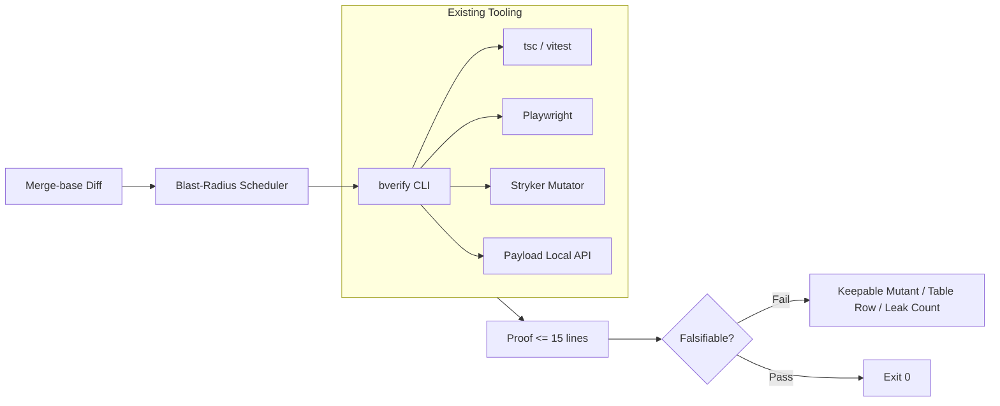

# Behavioral Verification: Expert Adoption Bar

What would make Uncle Bob, Matt Pocock, and Viktor Farcic actually run this tool.

Useful as discipline and integration join, never as a branded monolith.

---

## 1. Normative Adoption Bar

All seven must hold or they will not use it:

1. **Default run ~60s on merge-base blast radius.** Analyzes changed packages and their transitive dependents only. Whole-repo full runs are opt-in.
2. **Wraps existing tools — zero new test frameworks.** Executes `tsc`, `vitest`, `playwright`, `stryker`, and Payload Local API directly. No proprietary assertion dialect, no custom test runner daemon.
3. **Proof $\le$ 15 lines, strictly falsifiable.** Outputs exact failure coordinates: surviving mutant AST diff, failing truth-table input/output row, or allocation leak delta. No multi-page narrative reports.
4. **AI cannot mark PASS.** Code scores execution outcomes deterministically. AI agents may generate test candidates, probe scripts, or boundary matrices; only deterministic runners assign pass/fail.
5. **Fast path vs. Campaign mode.** PR runs execute fast path only. Campaign mode (HTW matrix calibration, kernel/access exhaustive suites) runs on scheduled baseline checks, never across 8 cells on an everyday site PR.
6. **One install, one command.** Single configuration file (`.bverify.yaml` or zero-config auto-detect). Single CLI command: `bverify`.
7. **Failure produces a keepable artifact.** Every failure outputs a minimal reproducible failing unit test, a surviving mutant definition, or a committed table row that drops straight into the target test suite.

---

## 2. Expert Persona Adoption Matrix

| Expert | Core Want | Instant Reject Trigger |
| :--- | :--- | :--- |
| **Uncle Bob** *(Robert C. Martin)* | **Falsifiable behavioral boundary tables.** Clean separation of policy from IO detail; deterministic failure evidence over coverage percentages. | Flaky end-to-end mocks passing as "tests", bloated assertion frameworks, or generative LLMs hallucinating test verdicts. |
| **Matt Pocock** *(TypeScript / DX)* | **Zero-overhead TypeScript integration.** Relies on `tsc --noEmit` and native `vitest`; sub-second type-level diagnostics on dirty file sets. | Proprietary config files that shadow `tsconfig.json`, custom DSLs instead of TypeScript types, or CLI runs > 90s on small PRs. |
| **Viktor Farcic** *(DevOps / GitOps)* | **Deterministic CLI and CI pipeline exit codes.** Clean headless execution, predictable exit 0/1 codes, portable containers, zero background daemon lock-in. | Interactive-only dashboards, opaque SaaS reporting dependencies, or runs that require manual triage to unblock CI gates. |

---

## 3. Calibration vs. Verification Note

- **HTW (`unclebob/HTW`, HTWCleanCoders script tables)** is used strictly for **calibration**: verifying that table runner harnesses correctly parse boundary state matrices.
- Never impose full HTW combinatorial matrices on application PRs or content schemas.
