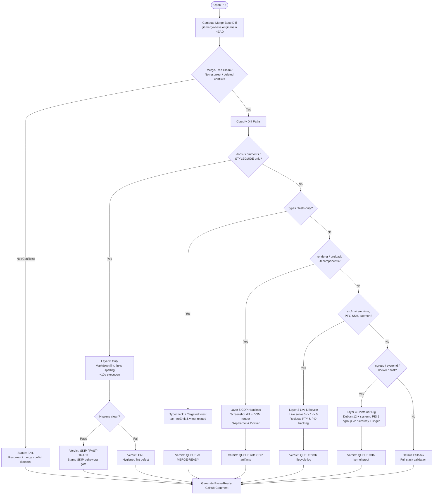

# Behavioral Verification Profile: Orca Maintainer Triage (`orca-maintainer-triage`)

## Executive Summary & Design Rationale

This document defines the normative specification and operational profile `orca-maintainer-triage` for repository maintainer triage across large backlog PR volumes (~3,000 PRs).

### Core Constraint: Bottleneck is Time, Not Verification Philosophy
@nwparker already executes and values behavioral verification across Layers 0 through 5 by hand. The bottleneck is strictly maintainer review bandwidth and triage latency. Triage tooling must accelerate decision-making rather than impose theoretical overhead.

### Triage Philosophy
- **Default Action:** `CLASSIFY` &rarr; `SKIP` or `QUEUE`.
- **Prohibited Gates:**
  - Never run an 8-cell combinatorial matrix.
  - Never mandate full How-To-Win (HTW) ceremonial documents.
  - Never run Stryker mutation testing on renderer/UI code.
  - Never emit a synthetic "AI PASS" rubber stamp.
- **Fail-Closed Invariant:** One false green on a cgroup or PTY pull request destroys trust and kills the verification tool. If kernel, PTY, or cgroup checks cannot run with high fidelity, fail closed (`QUEUE` for manual verification or fail check).
- **Zero Waste Invariant:** Documentation, typography, and comment-only PRs must never wait on Docker container boot or live daemon spins.
- **Proof Bar:** Proof is governed strictly by the maintainer rubric below, not the generic &le;15-line expert bar (which applies to developer self-serve profiles).

---

## Triage Classification Matrix (Merge-Base Diff)

Classification **must** be evaluated against `git merge-base origin/main HEAD` (the true three-way merge base), **never** against `HEAD` alone. Evaluating `HEAD` alone misses upstream changes, regressions reintroduced by merge commits, and deleted-file resurrect conflicts.



### Classification Tiers

| Tier | Path Patterns | Verification Scope | Target Latency | Pass/Action |
| :--- | :--- | :--- | :--- | :--- |
| **1. Docs & Style** | `docs/**`, `*.md`, `STYLEGUIDE*`, comment-only edits | Layer 0 only: Markdown syntax, doc link validity, spelling/hygiene. **Never boot Docker or Node runtime.** | ~10 seconds | Stamp `SKIP` (no behavioral test needed) or hygiene `FAIL`. |
| **2. Types & Tests** | `**/*.d.ts`, `tests/**`, `*.test.ts` (test-only changes) | `pnpm tsc --noEmit` + targeted `vitest run <impacted-specs>`. | ~30–60 seconds | Stamp clean test run or compilation error. |
| **3. Renderer & Preload** | `src/renderer/**`, `src/preload/**`, UI assets | Layer 5 CDP Headless: Launch headless browser/CDP test, take DOM snapshot + screenshot, verify UI hydration. **Skip kernel/cgroup tests.** | ~45–90 seconds | Stamp CDP visual capture & DOM assertion. |
| **4. Runtime & Daemon** | `src/main/runtime/**`, PTY managers, SSH handlers, daemon lifecycle | Layer 3 Live Lifecycle: Live serve spin-up, exercise connection, teardown, verify strict `0 -> 1 -> 0` residual child process and PTY leak invariant. | ~60–120 seconds | Fail closed on any orphaned PID or unclosed descriptor. |
| **5. Kernel & Host** | `src/main/host/**`, cgroups, systemd units, Dockerfile, PAM, linger | Layer 4 Container Rig: Isolated Debian 12 container (`systemd` PID 1, cgroup v2 unified hierarchy, user linger scope). | ~2–4 minutes | Fail closed on cgroup v2 traversal mismatch or lingering user slice leak. |

---

## Fail-Closed & Efficiency Invariants

1. **The cgroup / PTY Integrity Invariant:**
   A false green on process isolation, PTY teardown, or cgroup memory enforcement allows rogue or zombie processes onto developer host machines. If the container rig or lifecycle probe fails or cannot obtain definitive proof, the check **fails closed** immediately (`FAIL` or manual triage escalation).
2. **Docs Bypass Invariant:**
   Documentation changes must complete within 10 seconds. Invoking Docker, compiling Electron native modules, or executing browser smoke tests on doc PRs is strictly prohibited.
3. **No Synthetic AI Passes:**
   Every reported result must map to a physical exit code or stdout/stderr artifact from `bverify` or underlying test scripts. Never emit an automated "AI looks good" summary without executable behavioral evidence.

---

## Configuration Specification (`.bverify.yaml`)

Snippet configuring the `orca-maintainer-triage` profile within the repository root `.bverify.yaml`:

```yaml
version: 1
profiles:
  orca-maintainer-triage:
    description: "Rapid classification and triage runner for @nwparker reviewing high-volume Orca PRs"
    fail_closed: true
    merge_base_ref: "origin/main"
    prohibited_checks:
      - "combinatorial_8_cell"
      - "htw_full_ceremony"
      - "stryker_mutation_renderer"
      - "synthetic_ai_pass"

    classification:
      - name: "docs-only"
        match:
          all:
            - "^(docs/.*|.*\\.md|STYLEGUIDE.*)$"
        layer: 0
        timeout_seconds: 15
        action: "skip_behavioral"
        runners:
          - "markdownlint"
          - "link-check"

      - name: "types-and-tests"
        match:
          all:
            - "^(tests/.*|.*\\.test\\.ts|.*\\.d\\.ts)$"
        layer: 1
        timeout_seconds: 90
        action: "targeted_test"
        runners:
          - "pnpm tsc --noEmit"
          - "pnpm vitest run {impacted_specs}"

      - name: "renderer-ui"
        match:
          any:
            - "^src/renderer/.*"
            - "^src/preload/.*"
        layer: 5
        timeout_seconds: 120
        action: "cdp_visual_smoke"
        runners:
          - "bverify probe --surface renderer --cdp-screenshot"

      - name: "runtime-pty-daemon"
        match:
          any:
            - "^src/main/runtime/.*"
            - "^src/main/pty/.*"
            - "^src/main/ssh/.*"
            - "^src/daemon/.*"
        layer: 3
        timeout_seconds: 180
        action: "lifecycle_probe"
        runners:
          - "bverify probe --track-pids --assert-zero-leak"

      - name: "kernel-cgroup-host"
        match:
          any:
            - "^src/main/host/.*"
            - "^tests/docker/.*"
            - "^systemd/.*"
            - ".*cgroup.*"
        layer: 4
        timeout_seconds: 300
        action: "container_rig"
        runners:
          - "bash tests/docker/run-behavioral-container.sh"
          - "bverify matrix --cgroup-v2"
```

---

## Paste-Ready GitHub Comment Template

When `bverify` runs under the `orca-maintainer-triage` profile, it outputs an exact Markdown block formatted for direct pasting into GitHub PR review comments.

### GitHub Comment Specification

```markdown
<!-- bverify-maintainer-triage-start -->
### 🔍 Fresh behavioral verification: PR #{pr_number} ({pr_title})

**Triage Profile:** `orca-maintainer-triage` | **Commit:** `{head_sha}` | **Target:** `{base_branch}`

#### 1. Merge Base & Tree Cleanliness
- **Merge Base:** `{merge_base_sha}`
- **Three-Way Merge-Tree Status:** `{MERGE_TREE_STATUS}` <!-- PASS: Clean / FAIL: Resurrected or deleted conflict -->
{conflict_details_if_any}

#### 2. Classification & Blast Radius
- **Category:** `{CLASSIFIED_CATEGORY}` <!-- Docs / Types-Tests / Renderer / Runtime-PTY / Kernel-Cgroup -->
- **Changed Files:** `{changed_file_count}` files (`{changed_test_spec_count}` test specs impacted)
- **Targeted Vitest Specs:**
{targeted_vitest_specs_list}

#### 3. Behavioral Verification Layers Executed
| Layer | Scope | Result | Details |
| :--- | :--- | :--- | :--- |
| **Layer 0** | Hygiene & Merge Tree | `{L0_RESULT}` | `{L0_DETAILS}` |
| **Layer 1** | Types & Targeted Vitest | `{L1_RESULT}` | `{L1_DETAILS}` |
| **Layer 3** | Live Serve & PTY Invariant | `{L3_RESULT}` | `{L3_DETAILS}` |
| **Layer 4** | Container Rig (cgroup/systemd) | `{L4_RESULT}` | `{L4_DETAILS}` |
| **Layer 5** | Renderer / CDP Screenshot | `{L5_RESULT}` | `{L5_DETAILS}` |

#### 4. Runtime Invariants & Evidence
- **Process Lifecycle Transition (0 &rarr; 1 &rarr; 0):** `{LIFECYCLE_EVIDENCE}`
- **cgroup v2 / systemd Verification:** `{CGROUP_EVIDENCE_OR_SKIPPED}`
- **Renderer Visual Proof:** `{CDP_SCREENSHOT_LINK_OR_N_A}`

#### 5. Maintainer Verdict
**Verdict:** `{VERDICT_STAMP}` <!-- SKIP (Docs) / PASS (Merge-Ready) / QUEUE (Review Needed) / FAIL (Defect) -->
**Triage Recommendation:** {RECOMMENDATION_NOTE}
<!-- bverify-maintainer-triage-end -->
```

---

### Example Concrete Comment (Runtime / PTY Change)

```markdown
### 🔍 Fresh behavioral verification: PR #2841 (Fix PTY session detach cleanup on client disconnect)

**Triage Profile:** `orca-maintainer-triage` | **Commit:** `4f8a12e` | **Target:** `main`

#### 1. Merge Base & Tree Cleanliness
- **Merge Base:** `9a0b1c2` (upstream `main` @ 2026-09-11 18:22:10 UTC)
- **Three-Way Merge-Tree Status:** ✅ Clean (no resurrected or deleted file conflicts)

#### 2. Classification & Blast Radius
- **Category:** `Runtime & PTY Daemon` (`src/main/runtime/pty-session.ts`, `src/main/runtime/process-tree.ts`)
- **Changed Files:** 2 files (1 test spec impacted)
- **Targeted Vitest Specs:**
  - `src/main/runtime/pty-session.test.ts` (14 passed, 0 failed, 4.2s)

#### 3. Behavioral Verification Layers Executed
| Layer | Scope | Result | Details |
| :--- | :--- | :--- | :--- |
| **Layer 0** | Hygiene & Merge Tree | ✅ PASS | Three-way merge clean against `main` |
| **Layer 1** | Types & Targeted Vitest | ✅ PASS | TypeScript clean; targeted vitest specs passed |
| **Layer 3** | Live Serve & PTY Invariant | ✅ PASS | 0 &rarr; 1 &rarr; 0 clean: 0 orphaned PIDs, 0 PTY descriptors leaked |
| **Layer 4** | Container Rig (cgroup/systemd) | ⏭️ SKIPPED | PR does not touch `src/main/host/**` or cgroups |
| **Layer 5** | Renderer / CDP Screenshot | ⏭️ SKIPPED | No renderer or preload files modified |

#### 4. Runtime Invariants & Evidence
- **Process Lifecycle Transition (0 &rarr; 1 &rarr; 0):**
  - Baseline before launch: 0 `orcad` / 0 `pty-helper` processes.
  - Active session: PID 41208 spawned (`/data/opt/revive/orca_serve/bin/pty-helper`).
  - Post-disconnect SIGTERM: process tree exited within 380ms.
  - Residual after teardown: 0 residual processes, 0 leaked descriptors verified via `/proc/$$/fd`.
- **cgroup v2 / systemd Verification:** Not required for diff scope.
- **Renderer Visual Proof:** N/A

#### 5. Maintainer Verdict
**Verdict:** `QUEUE (Ready for Review)`
**Triage Recommendation:** Behavioral invariants satisfied. Safe to review and merge without container regression risk.
```

---

### Example Concrete Comment (Documentation Only PR)

```markdown
### 🔍 Fresh behavioral verification: PR #2845 (docs: update ssh host key verification runbook)

**Triage Profile:** `orca-maintainer-triage` | **Commit:** `8e72da1` | **Target:** `main`

#### 1. Merge Base & Tree Cleanliness
- **Merge Base:** `9a0b1c2`
- **Three-Way Merge-Tree Status:** ✅ Clean

#### 2. Classification & Blast Radius
- **Category:** `Docs & Style` (`docs/reference/ssh-host-key-verification.md`)
- **Changed Files:** 1 file (0 test specs impacted)
- **Targeted Vitest Specs:** None

#### 3. Behavioral Verification Layers Executed
| Layer | Scope | Result | Details |
| :--- | :--- | :--- | :--- |
| **Layer 0** | Hygiene & Merge Tree | ✅ PASS | Markdown lint clean, internal anchors verified (8.2s) |
| **Layer 1** | Types & Targeted Vitest | ⏭️ SKIPPED | Documentation change only |
| **Layer 3** | Live Serve & PTY Invariant | ⏭️ SKIPPED | Bypassed per docs-only triage rule |
| **Layer 4** | Container Rig (cgroup/systemd) | ⏭️ SKIPPED | Docker container not launched |
| **Layer 5** | Renderer / CDP Screenshot | ⏭️ SKIPPED | No UI change |

#### 4. Runtime Invariants & Evidence
- **Process Lifecycle Transition (0 &rarr; 1 &rarr; 0):** Bypassed.
- **cgroup v2 / systemd Verification:** Bypassed.
- **Renderer Visual Proof:** N/A

#### 5. Maintainer Verdict
**Verdict:** `SKIP (Behavioral Verification Not Required)`
**Triage Recommendation:** Fast-trackable documentation update. No runtime regression surface.
```
