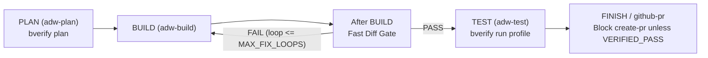

# Behavioral Verification Riley PR Gate Specification

## Purpose & Audience

This specification defines the behavioral verification pre-submission gate integrated into Riley's pull request creation workflow (`github-pr` skill and `scripts/github.py create-pr` / `create-upstream-pr`), with explicit focus on guarding upstream contributions (e.g., to `stablyai/orca`).

### Audience Lock: Vibe Coders & AI Engineers (Not Traditional Software Developers)
Primary users are vibe coders, operators, and AI engineers (like Lesley) who orchestrate coding agents and want reliable, high-quality code without becoming full-time software maintainers or repeating nwparker-style review drains.

To serve this audience:
- **Plain English Failures**: The default gate report MUST NOT emit compiler-level trivia, matrix math, 8-cell diagrams, or academic terminology (no HTW, no formal methods jargon).
- **Clear Actionable Reasons**: Reports speak directly:
  - *"This test never fails even when the code is broken (fake safety)."*
  - *"This pull request resurrects a file that main deleted."*
  - *"Cannot verify live behavior safely in this environment. Do not open the PR."*
- **Expert profiles stay optional**: Deep diagnostics and underlying AST traces remain accessible via explicit flags (`--expert` or `--json`), but the default report is 100% human-readable and decision-focused.

---

## Two Distinct Categories of Slop

To avoid confusion, the pipeline strictly separates text polish from broken code patterns:

| Category | What it Looks Like | Who Handles It | Role in this Gate |
| :--- | :--- | :--- | :--- |
| **Prose Slop** | Fluffy PR descriptions, apologies, robotic AI commentary, hallucinated feature descriptions, leaked private paths/names. | Existing `no-ai-slop` skill, Gemini PR review, and privacy scrubbers. | **Out of scope for `bverify` runtime**. Checked separately on PR title and description text. |
| **Code Slop & Traps** | Tests that check nothing, fake mocks of real operating systems, junk-drawer files (`helpers.ts`), turned-off line limits, confusing `0` with `null`, hanging network calls, re-adding deleted files. | **Behavioral Verification Riley PR Gate (`bverify`)** | **Core focus of this gate**. Hard blocker that stops `create-pr` before it ever touches GitHub. |

---

## The Verification Chain (What the Gate Checks)

Before creating any pull request against `main` or an upstream repo, the gate inspects every change between the target branch and your work:

```
[ Your Branch Diff ]
         │
         ▼
┌──────────────────────────────────────┐
│ 1. Merge Safety & Deleted Files     │  Stops merge conflicts and resurrected deleted files
└──────────────────┬───────────────────┘
                   │
                   ▼
┌──────────────────────────────────────┐
│ 2. Forbidden Code-Slop Scan          │  Catches disabled linters, junk files, platform traps
└──────────────────┬───────────────────┘
                   │
                   ▼
┌──────────────────────────────────────┐
│ 3. Targeted Test Run                 │  Runs tests for touched code
└──────────────────┬───────────────────┘
                   │
                   ▼
┌──────────────────────────────────────┐
│ 4. Test Reality Check (No Fake Tests)│  Proves tests fail if the code is actually broken
└──────────────────┬───────────────────┘
                   │
                   ▼
┌──────────────────────────────────────┐
│ 5. Live Behavior Probes (Real OS)    │  Verifies terminals, runtime, SSH, cgroups for real
└──────────────────┬───────────────────┘
                   │
                   ▼
┌──────────────────────────────────────┐
│ Final Decision Gate                  │  PASS -> Open PR; FAIL/MANUAL_REVIEW -> Stop completely
└──────────────────────────────────────┘
```

---

## Plain-Language Verification Rules

### 1. Merge Safety & Deleted Files
- **Merge Check**: Verifies that your branch will merge cleanly into the target branch without git conflicts.
- **Deleted Files Watch**: If your branch re-introduces a file that was previously deleted on `main`, the gate blocks it:
  > *"This re-adds a file that main deleted. If this was intentional, declare an explicit file restoration; otherwise remove it."*

### 2. Forbidden Code-Slop Scan
Fast regex scan catching AI shortcuts that annoy human maintainers:
1. **Disabled Limits**:
   - `/* eslint-disable max-lines */` or comments disabling line limits.
   - Blanket ignore statements (`@ts-ignore`, `biome-ignore`) without a linked issue.
2. **Junk Drawer Files**:
   - Creating files named `helpers.ts`, `utils.ts`, `common.ts`, `misc.ts`, or generic folders like `src/**/helpers/*`.
   - *Plain reason:* Put functions where they belong in domain files, not in catch-all utility trash bins.
3. **Platform Shortcut Traps**:
   - Using `e.metaKey` or `e.ctrlKey` without platform checking (breaks Mac vs Windows/Linux shortcuts).
4. **Sneaky Logic Traps**:
   - Treating `0` as empty/null (e.g. `!exitCode` or `!fileSize` where 0 is a valid number, not an error).
   - Unbounded object spread in loops.
   - Long-running network or RPC calls without a timeout or cancel signal.

### 3. Targeted Test Run
- Finds and runs the tests covering the exact files you changed.
- Must finish with zero errors.

### 4. Test Reality Check (AI Anti-Slop)
AI agents love writing tests that look great but don't actually test anything. The gate checks:
- **No Empty Tests**: Tests must have real expectations, not just `expect(true).toBe(true)`.
- **No Mocking the Operating System**: Tests touching terminal (PTY), SSH, or file systems cannot replace the OS with fake mocks.
- **Broken Code Must Fail the Test**: The gate temporarily inverts or breaks the change. If the new test still passes with broken code, it is flagged:
  > *"This test never fails even if the code is wrong. It only provides fake coverage and will not catch regressions."*

### 5. Live Behavior Probes
When your code touches core system plumbing:
- `src/main/runtime/**`
- `src/main/pty/**` (terminals)
- `src/main/ssh/**` (remote connections)
- `src/main/cgroup/**` (process resource control)

The gate must run a real, live probe (e.g., spawning an actual terminal and checking signals like Ctrl+C or window resize).

---

## Fail-Closed Rules: When to Stop

The gate is strictly **fail-closed**:

| Verdict | What Happened | Action |
| :--- | :--- | :--- |
| **PASS** | Every check passed and verified live behavior. | Attach verification stamp to PR description; open PR. |
| **FAIL** | Code slop, fake test, or merge problem detected. | **Stop immediately. Do not open the PR.** Fix the listed issues. |
| **MANUAL_REVIEW** | The test environment is missing required tools to safely run live probes. | **Stop immediately. Do not open the PR.** Alert Lesley for manual check. |

> **Hard Rule:** If the gate says `MANUAL_REVIEW`, Riley will **never** open a pull request automatically.

---

## Default Gate Output (Plain English, Non-Developer Friendly)

When the gate runs, the summary output shown to the user is clear, direct, and free of engineering jargon:

### Example Failure Output (Blocked PR):
```text
======================================================================
🛑 PULL REQUEST BLOCKED BY BEHAVIORAL GATE
======================================================================

The gate found 2 problems in your branch:

1. Fake Safety (Layer 3):
   File: tests/unit/pty-session.test.ts:42
   Problem: This test never fails even if the underlying code is broken.
   Action: Add real assertions that check actual terminal output.

2. Junk Drawer File (Layer 1):
   File: src/utils/helpers.ts
   Problem: Creating generic 'helpers' or 'utils' files is banned.
   Action: Move these helper functions directly into the file that uses them.

Verdict: FAIL
Do not open the PR until these items are fixed.
======================================================================
```

### Example Environment Limitation (MANUAL_REVIEW Block):
```text
======================================================================
⚠️ PULL REQUEST PAUSED: MANUAL REVIEW REQUIRED
======================================================================

Verdict: MANUAL_REVIEW

Reason: Your code modifies terminal handling ('src/main/pty/'), but this
machine cannot run live PTY probes in the current environment.

We cannot prove this change will not hang or break terminals.

Action: Do not open the PR automatically. A human (Lesley) must review
and verify this branch on a full test workstation.
======================================================================
```

---

## PR Description Verification Block (Pasted into GitHub PR)

When the gate produces a **PASS**, it generates this clean verification summary to paste into the PR description:

```markdown
<!-- BEGIN BEHAVIORAL VERIFICATION (riley-pr-gate) -->
### 🛡️ Behavioral Verification: PASS

Verified on commit `a1b2c3d` against `origin/main`:

- [x] **Clean Merge**: No conflicts and no resurrected deleted files.
- [x] **Clean Code Standards**: No disabled line budgets, no junk `helpers.ts` files, platform keys verified.
- [x] **Targeted Tests**: All relevant unit and integration tests passed.
- [x] **Real Test Safety**: Confirmed tests actually fail when the logic is broken.
- [x] **Live System Probes**: Real terminal and process behaviors checked and working.

*Gate Profile: `riley-pr-gate` | Safe to merge.*
<!-- END BEHAVIORAL VERIFICATION -->
```

---

## Configuration File (`.bverify.yaml`)

The default configuration profile is saved in `.bverify.yaml` at the root of the repository:

```yaml
profile: riley-pr-gate
version: 1

# Fail-closed policy: any uncertainty blocks PR creation
policy:
  fail_closed: true
  block_on_manual_review: true

# Clean merge and history rules
clean_history:
  require_clean_merge: true
  block_resurrected_files: true

# Forbidden slop patterns
forbidden_code_patterns:
  - id: no-max-lines-disable
    pattern: 'eslint-disable.*max-lines'
    message: 'Disabling max-lines is prohibited. Break up large files instead.'
  - id: no-junk-drawers
    file_pattern: '(^|/)(helpers|utils|common|misc)\.(ts|js|py)$'
    message: 'Do not create helpers.ts or utils.ts files. Co-locate code with its feature.'
  - id: platform-aware-modifiers
    pattern: 'e\.metaKey(?!.*platform)'
    message: 'Must handle Mac (Command) vs Windows/Linux (Ctrl) properly.'
  - id: no-os-mocking
    path_pattern: 'tests/(pty|ssh|runtime)/**'
    pattern: 'jest\.mock\("node:pty"\)|vi\.mock\(["'']node:pty["'']\)'
    message: 'Do not mock operating system tools in terminal or runtime tests.'

# Sensitive system files that require a real working probe
sensitive_systems:
  - path: 'src/main/runtime/**'
    probe: 'bin/probe-runtime'
  - path: 'src/main/pty/**'
    probe: 'bin/probe-pty'
  - path: 'src/main/ssh/**'
    probe: 'bin/probe-ssh'
  - path: 'src/main/cgroup/**'
    probe: 'bin/probe-cgroup'

# Test quality assurance
test_standards:
  require_real_assertions: true
  reject_fake_coverage_tests: true
```

---

## CLI & Tool Integration (`scripts/github.py`)

In Riley's `github-pr` automation (`scripts/github.py`):

1. **Before any PR is created**, the script executes:
   ```bash
   bverify run --profile riley-pr-gate
   ```
2. **Handle Exit Codes**:
   - `0 (PASS)`: Embed the Markdown stamp and proceed with GitHub PR creation.
   - `1 (FAIL)`: Print the plain-English problem list and abort immediately.
   - `2 (MANUAL_REVIEW)`: Print the warning, notify Lesley, and abort without opening the PR.

---

## ADW call sites

**Agent proposes, code disposes.** `bverify` is a **code gate**, never an agent self-grade. The agent cannot certify its own output or self-report "tests passed" without the gate exit code.

### Call Sites

1. **PLAN (`adw-plan`)**: Run `bverify plan` only. Evaluates merge-tree cleanliness and blast radius. No live services or probes run here. Fast and cheap.
2. **After BUILD (code gate)**: Runs directly against the diff as a code gate (not inside every internal BUILD hop). If `FAIL`, re-prompts the BUILD agent with the plain failure output. Retries are capped by `MAX_FIX_LOOPS`.
3. **TEST (`adw-test`)**: Profile run tailored to this repository (`bverify run --profile riley-pr-gate`). Exercises Orca live layers if runtime code was touched, while skipping kernel/live probes if the diff is docs-only.
4. **FINISH / github-pr**: Hard-blocks `create-pr` and `create-upstream-pr` unless the verdict is `VERIFIED_PASS`. A `MANUAL_REVIEW` verdict halts execution and will not open a PR.

### Must Not

- **Scout (read-only)**: Never run gates on exploratory or read-only scout tasks.
- **Every ADW hop / token loop**: Do not run the full verification gate on internal agent reasoning loops or intermediate thought turns.
- **Temporal**: Never attach gate verification to Temporal workflows unless a real, concrete queue exists.
- **Agent self-certification**: The agent must never write "tests passed" or claim verification in the envelope without the gate exit code (`0`).

### Flow Diagram


