# Riley PR-Check Coverage Map: Maintainer Tags to Verification Profile

> **Status:** Authoritative Coverage Reference & Gap Analysis  
> **Command:** `riley pr-check`  
> **Architectural Standard:** nwparker-class empirical behavioral verification & Clean Boundaries  
> **Coverage Goal:** Honest capability mapping across current implementation, planned phases, and unaddressed gaps. **Never claim 100% coverage.**

---

## 1. Operating Modes & Universal Contract

The `riley pr-check` engine shares a unified verification core operating across two deployment modes:

1. **Author Mode (Local Pre-Submission Gate):**  
   Runs locally before `create-pr` or `create-upstream-pr` to intercept broken abstractions, slop, regressions, and resurrected files before external maintainers review the branch. Slice 1 implements the author-side gate.
2. **Maintainer Mode (Inbound PR Validation):**  
   Executes against inbound PRs on Lesley-owned repositories (starting with `dot-ai-grafana`). Evaluates third-party contributions against project-specific constraints, authorization boundaries, wire formats, and evidence preservation rules, emitting blocking verdicts or PR review comments.

### Composed Architecture & Slice 1 Posture
- **Composed, Not Cloned:** Leverages `aislop` via `ci --changes --base <target>` (fallback: `scan --changes --base <target> --json`) as a fail-closed gate. Clean exit 0 allows execution to proceed to targeted tests; exit 1 yields `FAIL`; crash, runner failure, or withheld score yields `MANUAL_REVIEW` (withhold $\neq$ `PASS`).
- **Targeted Test Execution:** Executes targeted unit/spec runs against touched surfaces; verifies tests are capable of failing.
- **Fail-Closed Verdicts:** `FAIL` or `MANUAL_REVIEW` acts as a hard block against PR creation (`create-pr`).
- **No 100% Claim:** Many subtle kernel races, asynchronous lifecycle transitions, cross-version wire protocols, and live cluster mutations cannot be fully proven without hermetic rigs or dedicated staging environments. Gaps must be acknowledged explicitly.

---

## 2. Orca (nwparker-Class) Coverage Map

This table maps known maintainer failure modes and behavioral tags (derived from Orca PR history and `docs/reference/behavioral-verification-architecture.md`) to Slice 1 capabilities, subsequent roadmap horizons ("Later"), and remaining unaddressed risks ("Gaps").

| Tag / Failure Mode | Root Cause / Exemplar Citations | Slice 1 Now (`riley pr-check`) | Later Profile (`bverify` / Rig) | Gap / Blind Spot |
| :--- | :--- | :--- | :--- | :--- |
| **merge-tree / Resurrected deleted file** | Re-creating or re-opening a deleted store/file via stale file descriptors or git rebase/merge anomalies (PR #10612). | **Covered:** `git merge-tree --write-tree` detects merge anomalies against `origin/main`; static check flags re-addition of files deleted on base branch. | **Full Hygiene Gate:** Dynamic filesystem inode monitoring ensuring post-teardown `open()` returns `ENOENT` across processes. | Subsurface memory caches reopening paths via external unmanaged daemons or non-git syncs. |
| **Live PTY / Browser $0 \to 1 \to 0$ resource leaks** | Zombie PTY masters, unclosed pts slaves, orphan Electron renderer processes surviving window closure (PR #10612, #18790, #16829). | **MANUAL_REVIEW / Untracked:** Flagged if diff alters process-spawning or PTY code via static analysis heuristics; no live process audit. | **Layer 2 Live Lifecycle:** Real process tree assertions: `pgrep -P <pid>` is empty, no `pts/` entry in `Z` state, `lsof +E` returns to 0. | Non-POSIX platform subtleties (Windows console handles) not reproducible in basic Linux container rigs. |
| **cgroup v2 ancestor `pids.max`** | Checking leaf `pids.max` (which reports `max`) while an ancestor slice imposes a strict process limit (PR #10612, #19430). | **Out of Scope / Missed:** Static checks cannot observe live cgroup hierarchies or filesystem limits. | **Layer 4 Kernel Probe:** Executes inside Docker/systemd container; tests ancestor walk against simulated hierarchical limits. | Non-cgroup environments (macOS host runners, WSL1, or nested unprivileged Docker without cgroup delegation). |
| **systemd `KillMode=mixed` / linger / daemon restart** | Daemon restarts under `KillMode=mixed` sending SIGTERM to main PID but SIGKILL to cgroup after ~56ms; linger survival (PR #19430, #18790). | **Out of Scope:** Local author gate does not run systemd services or measure SIGKILL termination timing. | **Layer 4 Systemd Rig:** Containerized probe running systemd as PID 1; asserts clean teardown within grace window without zombie processes. | Host kernel timing jitter; differing systemd version behaviors across distros (Debian vs Alpine vs Arch). |
| **Delayed `readdir` vs cache TTL (3.5s / 30s / 5m)** | Adversarial I/O delay (>3.5s) causing scanner to collapse into false-empty directory or cache desync (PR #19314). | **Targeted Unit Tests:** Executes existing unit tests for scanner logic if touched; no runtime latency injection. | **Layer 3 Fault Injection:** `NODE_OPTIONS="--require fault-injector.cjs"` delays `readdir` to 3.6s, verifying timeout/retry vs empty collapse. | Real kernel NFS/CIFS network stalls with unbounded blocking un-interruptible I/O (`D` state). |
| **Hanging RPC / Socket no timeout** | Remote sockets or IPC connections accepted but left unserviced; callers wedge indefinitely without deadlines (PR #3737, #3739, #3742). | **aislop Static Heuristics:** Flags obvious missing timeout parameters or naked promises in touched diffs; yields `MANUAL_REVIEW`. | **Layer 3 Wedged Socket Probe:** Spawns mock TCP/IPC servers that accept and stall; validates caller hits strict timeout and tears down. | Half-open TCP connections subject to OS keepalive timers (7200s default) escaping application timeouts. |
| **0 vs null unsupported metrics** | Reporting `0` instead of `null` or `undefined` for unsupported counters, creating false negative health claims (PR #10612, #16829). | **Targeted Unit Tests:** Verifies existing assertion suites run on metric serializers; fails on test breakage. | **Layer 1/5 Contract Parity:** Schema validation against mock and live provider outputs asserting `null` semantics on unsupported fields. | Undocumented provider APIs altering nullability without bumping schema versions. |
| **V8 spread stack overflow** | Using `Math.max(...largeArray)` or `fn(...args)` blowing V8 stack limit (~65,536 arguments) under production load (PR #3697). | **aislop AST Rule:** Static rule flags unbounded spread syntax (`...`) over dynamic arrays in touched files. | **Fuzzing / Mutation Tests:** Feeds generated arrays of $10^5$ items to public API entry points to assert heap/loop processing. | Dynamic spread occurring inside untyped third-party library dependencies. |
| **CLI not in dispatch manifest** | Implementing a CLI subcommand or flag without registering it in the router/dispatch manifest or schema. | **Static Hygiene:** Scans for exported CLI verbs lacking corresponding registration in dispatcher maps. | **CLI E2E Smoke Matrix:** Dispatches `--help` and basic invocations for all discovered CLI verbs in fresh subshells. | Dynamic argument forwarding or plugin-driven CLI extensions loaded at runtime. |
| **CDP console errors / window identity** | Stray errors in browser devtools log; test attaches to wrong window instance or background worker (PR #3739, #16829). | **Out of Scope:** Author mode does not spin up headless Electron or CDP connections for quick checks. | **Layer 5 UI CDP Probe:** Attaches Playwright over CDP to live Electron window under Xvfb; asserts `consoleErrors.length === 0` and window UUID. | Headless Xvfb display timing artifacts differing from native macOS/Windows compositor rendering. |
| **Windows + Linux pairing failures** | Path separator assumptions (`/` vs `\`), shell quoting, or child process invocation differences (PR #16829). | **Static Lint:** Checks for raw path concatenations, direct `child_process` imports, or hardcoded POSIX commands. | **Dual-OS CI Matrix:** Re-runs behavioral contract tests across native Windows and Linux test runner instances. | WSL2 translation layer anomalies (case sensitivity flags, DrvFs file metadata differences). |
| **Forbidden: `helpers.ts` / vague naming** | Dumping functions into `helpers.ts`, `utils.ts`, `common.ts` violating architectural naming mandates (`AGENTS.md`). | **Enforced (Slice 1):** Static path check fails if new or renamed files match `helpers.ts`, `utils.ts`, `common.ts`, `misc.ts`. | **Structural Linters:** AST check preventing loose functions with multiple disparate responsibilities. | Existing legacy files retained in codebase (ratchet only prevents additions). |
| **Forbidden: `max-lines` disable** | Bypassing complexity limits with `eslint-disable max-lines` or `oxlint-disable max-lines` (`AGENTS.md`). | **Enforced (Slice 1):** Regex scan rejects any added `eslint-disable max-lines` or `oxlint-disable max-lines` comments. | **Pre-commit / CI Ratchet:** Global AST audit rejecting file-length creep and configuration exceptions. | Indirect complexity explosion through chained one-line arrow functions. |
| **Forbidden: `e.metaKey` without platform check** | Hardcoding macOS `metaKey` without checking `navigator.userAgent.includes('Mac')` for Ctrl pairing (`AGENTS.md`). | **Enforced (Slice 1):** Grep check on modified frontend files flags `e.metaKey` lacking nearby platform check or `CmdOrCtrl`. | **Playwright Keyboard Simulation:** Cross-platform headless keypress tests asserting Cmd on Darwin and Ctrl on Linux/Win. | Obscured event wrappers from third-party UI libraries (e.g. Radix UI, Monaco editor). |

---

## 3. Grafana (`dot-ai-grafana`) Maintainer Inbound Coverage Map

This section is grounded in verified repository evidence from `/data/projects/dot-ai-grafana` and active worktrees (PR #13, PR #25, PR #43, PR #45, PR #48, PR #49). **No tags are invented; areas lacking evidence are explicitly designated UNKNOWN.**

### 3.1 Observed Maintainer Failure Modes & CI Gates
Evidence from `.github/workflows/ci.yml`, `Magefile.go`, `package.json`, and review history reveals seven primary failure classes in this repository:
1. **Evidence Displacement by Prior Context:** Follow-up conversational turns shedding live datasource evidence (Loki, Prometheus, Alertmanager) or question text to fit the 1000-character prompt budget (PR #49, PR #43).
2. **Undeclared REST/Wire Contract Mutations:** Altering request body fields (such as `hop` vs `hops` in `AskMeta`) consumed by the backend `dot-ai` REST endpoint (PR #13 Review B1).
3. **Missing Role Authorization on Resource Routes:** Failing to enforce Org Editor or Admin roles in Go backend handlers (`isEditorOrAbove`), relying mistakenly on `plugin.json` which only controls navigation visibility (PR #25, issue #26).
4. **Markdown Answer Sanitization (Remote Embed Leaks):** Relying solely on Grafana's default `renderMarkdown` / `sanitizeTextPanelContent` which permits `iframe`, `img`, and remote CSS embeds in LLM responses (PR #13 Review B5).
5. **0-Hop Navigation Classifier False Success:** Show-me queries returning success (`ok: true, hops: 0`) when evidence is toggled off or datasource results are completely empty (PR #13 Review B2).
6. **Backend Go/TypeScript Dual-Package Build Failures:** Magefile backend compilation (`Magefile.go`) and RxJS observable casting differences across `@grafana/data` and `@grafana/ui` version bumps (PR #48, commit `bbc95f8`).
7. **E2E Container Execution & Plugin Metadata Validation:** Missing `grafana/plugin-validator-cli` metadata verification or Playwright E2E failures on live Grafana containers across version matrices (CI `ci.yml`).

### 3.2 Inbound Coverage Table

| Tag / Failure Mode | Root Cause / Evidence from `dot-ai-grafana` | Slice 1 Now (`riley pr-check`) | Later Profile (Maintainer Mode) | Gap / Blind Spot |
| :--- | :--- | :--- | :--- | :--- |
| **Evidence Displacement / Intent Cap Truncation** | 1000-char budget packing shedding `Question:` or live Loki/Prom/Alertmanager evidence lines (PR #43, PR #49). | **Targeted Tests:** Runs `jest src/utils/progressiveContext.test.ts` if modified; fails on expectation mismatch. | **30,000 Fuzz Pack Invariant:** Runs property fuzz test verifying `maxPacked <= 1000`, question verbatim present, and deterministic evidence refunding. | Upstream `dot-ai` engine changing character limits or prompt tokenization models. |
| **Undeclared REST / Wire Contract Drift** | Mutating `AskMeta` fields (`hop: hops` vs `hops: MAX_ASK_HOPS`) silently breaking backend contract (PR #13 B1). | **aislop Static / Diff Check:** Flags changes to exported interfaces in `src/utils/dotaiApi.ts` or wire payloads. | **Wire Contract Schema Gate:** Strict JSON Schema parity test between frontend request serializer and Go backend parser. | Subtleties in URL query string encoding differences between Axios, fetch, and Grafana `backendSrv`. |
| **Resource Route Role Bypass (Editor vs Viewer)** | App resource routes (`resources/*`) in Go backend lacking `isEditorOrAbove` check; `plugin.json` fails to gate backend (PR #25). | **Static Grep:** Rejects new Go resource handlers lacking explicit role authorization helper invocation. | **Go Handler Integration Tests:** Backend unit tests executing HTTP requests with simulated Viewer and Editor identity headers. | Custom Grafana auth proxy headers or anonymous auth configurations overriding `backend.User`. |
| **LLM Markdown Remote Embed / XSS Injection** | Untrusted model response rendering `<iframe src="...">` or `` via loose Grafana markdown sanitizer (PR #13 B5). | **Static Invariant:** Rejects direct `dangerouslySetInnerHTML` additions outside vetted `ResponseMarkdown.tsx`. | **HTML Sanitizer Allowlist Gate:** Asserts strict element/attribute allowlist: no remote images, no iframes, external link `rel="noopener noreferrer"`. | CSS injection via inline style attributes if the sanitizer allowlist is widened. |
| **0-Hop Show-Me False Success on Empty Stack** | Classifier returning `ok: true` when stack read was skipped or empty, emitting broken empty drilldown links (PR #13 B2). | **Targeted Tests:** Runs `jest src/utils/askOrchestrator.test.ts` covering `skipStack` and `currentEmpty` guards. | **Playwright UI Exploration Gate:** Automated test verifying error toast/testid appears when evidence is disabled. | Dynamic cluster where datasources take >15s to respond, triggering ambiguous timeout states. |
| **Dual-Package RxJS / TS Compilation Errors** | TypeScript compiler errors when `@grafana/data` RxJS types diverge from global node_modules (commit `bbc95f8`). | **Covered:** `npm run typecheck` run as part of pre-flight checks if package script exists. | **Matrix Typecheck:** Runs `typecheck` across supported `@grafana/*` dependency variations. | Subtle runtime observable leaks that pass compilation but drop events in older browsers. |
| **Helm / CRD Reconcile Discrepancies** | Reconciler drift, CustomResourceDefinition schema mismatch, or live cluster apply failures. | **UNKNOWN:** No Helm charts or CRDs exist in `dot-ai-grafana` repository (it is a pure Grafana frontend/backend plugin). | **Cluster Rig (External Repos):** If applied to `dot-ai-stack` or infrastructure repos, executes `helm lint` and dry-run apply. | Real Kubernetes controller-manager validation webhook failures during live apply. |
| **Live Cluster vs YAML Lint Drift** | Static Kubernetes YAML valid according to yamllint, but rejected by live API server schema validation. | **UNKNOWN:** No direct Kubernetes manifests managed in `dot-ai-grafana`. | **Kubeconform / OpenAPI Schema Check:** Validates generated manifests against target Kubernetes API version schemas. | Dynamic Admission Controllers (e.g. Kyverno, OPA Gatekeeper) rejecting valid manifests. |
| **Plugin Metadata & Packaging Validator** | `plugin.json` failing Grafana marketplace metadata rules or invalid zip archive packaging (CI step `metadatavalid`). | **Slice 1 (Static):** Validates `src/plugin.json` parses as valid JSON and contains required ID/version fields. | **Containerized Validator:** Executes `grafana/plugin-validator-cli -analyzer=metadatavalid` inside Docker on packaged zip. | Upstream Grafana marketplace rules changing without notice in newer CLI releases. |

---

## 4. Coverage Gap Summary & Architectural Trajectory

```mermaid
flowchart LR
    subgraph S1[Slice 1: Author Gate]
        MT[merge-tree check]
        AS[aislop compose]
        TT[targeted tests]
        SL[static style / invariants]
    end
    subgraph Later[Later Profile: Rig & Maintainer]
        L2[Layer 2: 0->1->0 Leaks]
        L3[Layer 3: Fault Injection]
        L4[Layer 4: cgroup & systemd]
        L5[Layer 5: UI CDP Shell]
        MM[Maintainer Inbound Bot]
    end
    subgraph Gaps[Known Inherent Gaps]
        K1[OS Kernel Timing Jitter]
        K2[Live Cloud API Drift]
        K3[Unprivileged Host Sandboxes]
    end
    S1 --> Later
    Later -.-> Gaps
```

### 4.1 Summary of Honest Gaps
1. **Host Sandboxing Limits:** Slice 1 and standard CI runners lack root privilege and cgroup delegation (`/var/run/docker.sock` often inaccessible). True Layer 4 kernel behavioral testing requires dedicated container rigs (`tests/docker/run-behavioral-container.sh`) with systemd as PID 1.
2. **Asynchronous Race Windows:** Timing races such as systemd's ~56ms SIGKILL grace period under `KillMode=mixed` or tight socket teardowns can pass 99% of runs and fail under host CPU starvation. Deterministic fault hooks mitigate, but do not eliminate, real kernel concurrency jitter.
3. **Third-Party Upstream Evolution:** When external APIs (dot-ai REST, Grafana plugin SDK, OpenTelemetry wire specs) change undocumented behavior without breaking type definitions, synthetic tests and static analyzers remain blind until live integration probes run.

### 4.2 Maintenance Contract
- **Never claim 100%:** An automated gate cannot replace empirical proof on live runtimes.
- **Fail-Closed:** When a check encounters an unexpected environment, unparseable diff, or missing runner, it reports `MANUAL_REVIEW` rather than assuming safety.
- **Maintainer Accountability:** Maintainer mode gates are ratchets defending specific regression points discovered in real production reviews—not speculative academic linting.
