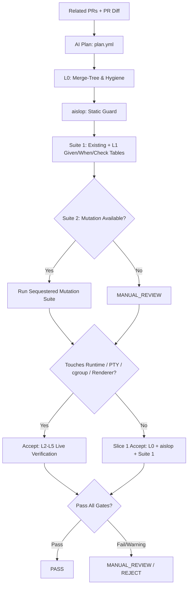

# RILEY PR-Check & Orca Layer Fit: Uncle Bob Two-Suite & Campaign Integration

This document defines how the Uncle Bob two-suite discipline and 8-cell campaign model map into the Orca layered behavioral verification architecture (`nwparker`) and `riley pr-check`.

---

## 1. Architectural Layers & Boundaries

The Orca layered verification architecture defines six progressive verification layers:

| Layer | Verification Target | Execution Characteristics |
|---|---|---|
| **L0** | Merge-Tree & Static Hygiene | Fast, deterministic AST/lint checks, tree cleanliness, formatting, and license/frontmatter audits. |
| **L1** | Blast Radius & Targeted Tests | Targeted unit/component test execution scoped to the diff; table-driven given/when/check tests; AI-proposed test tables. |
| **L2** | Live 0 → 1 → 0 Lifecycle Leaks | Ephemeral resource spinup/spindown testing (tempfiles, child processes, listeners, sockets). |
| **L3** | Fault & Latency Injection | Network jitter, dropped connections, timeout recovery, backoff validation. |
| **L4** | cgroup & systemd Isolation | OS-level boundaries, CPU/memory quotas, process containment, systemd unit lifecycles. |
| **L5** | Chrome DevTools Protocol (CDP) | Full renderer inspection, DOM mutation checks, event-loop tracing, UI automation. |

---

## 2. Uncle Bob Concept Fit

### 2.1 Frozen Production Base
- **Blast Radius Definition**: The "frozen production" baseline corresponds to the merge-base between target branch (`origin/main`) and feature branch.
- **Scope Limit**: Verification never rewrites or alters frozen baseline code across 8 Orca layers; the blast radius is computed strictly from the diff relative to the merge-base.

### 2.2 Suite 1: Regression, Discipline & Given/When/Check Tables
- **Composition**: Existing test suite plus newly added discipline tests covering modified codepaths.
- **Table-Driven Tests**: `given / when / check` parameter tables shaped by historical PR patterns, commit messages, and related issue tags.
- **Layer Fit**: **L1 only**. Related PRs provide structural context for L1 table generation; they **must not** seed Suite 2.
- **AI Role**: AI plans propose the L1 tables (`plan.yml`). Deterministic test runners execute them. AI output alone **never marks PASS**.

### 2.3 aislop Static Guard
- **Role**: Static anti-pattern and AI-generated code smell analyzer.
- **Layer Fit**: Runs alongside L0 as an always-on static gate. It is not an Uncle Bob test cell or behavioral layer.

### 2.4 Suite 2: Mutation-Grown Sequestered Suite
- **Composition**: Synthetic mutation suite grown from an empty test base against frozen production files to stress invariant boundaries.
- **Sequestered Execution**: Runs in isolation to measure mutant kill rates without contaminating standard regression suites.
- **Layer Fit**: Mutation test pass within L1/L2 boundaries. If mutation runners are unavailable in the runtime, this step gracefully skips to `MANUAL_REVIEW`.

### 2.5 CRAP Metrics (Change Risk Anti-Patterns)
- **Optional**: Computed only on changed functions after production code is identified and frozen. High-CRAP methods require additional L1 table coverage.

### 2.6 The Accept Boundary (`bb accept` Analogue)
- Uncle Bob `bb accept` maps to **Orca L2–L5** live behavioral layers.
- **Slice 1 (Weak Accept)**: Merge-tree hygiene + `aislop` static checks + Suite 1 targeted tests.
- **Full Accept**: L2 (leak verification), L3 (fault handling), L4 (cgroup/systemd containment), L5 (CDP inspection). Triggered only when diff touches runtime, PTY, process orchestration, cgroups, or renderer code. If live harnesses are unavailable, evaluation drops to `MANUAL_REVIEW`.

### 2.7 The 8-Cell Campaign: Campaign-Only, Not Default
- **8-Cell Grid**: Permutation of inputs, error boundaries, state invariants, and concurrency conditions.
- **Deployment**: Confined strictly to **L1 campaign runs on tiny, critical core modules** (e.g. auth crypto, token bucket, parser kernel).
- **Not Default**: The 8-cell campaign is explicitly **not** the default path for standard Orca PRs or day-to-day authoring.

---

## 3. Workflow Pipeline

---

## 4. Default Orca Author Path

For day-to-day development in Orca, the author path remains lean and predictable:

1. **L0 (Hygiene)**: Merge-tree cleanliness, formatting, commit linting.
2. **aislop**: Static scan for AI code patterns and slop.
3. **Suite 1 (L1)**: Targeted regression tests and table-driven input/output specs.
4. **Suite 2 (L1 Mutation)**: Run if mutation tooling is present; otherwise defer to `MANUAL_REVIEW`.
5. **Accept Gate**:
   - Standard changes (docs, UI styling, pure helpers): **Slice 1 Accept** (L0 + `aislop` + Suite 1).
   - Core changes (touching PTY, daemon runtime, cgroups, systemd, or Electron CDP): Full **L2–L5 Accept**.

*Note: AI proposals are non-authoritative. An automated pass verdict is produced solely by code execution; AI never issues an autonomous PASS.*

---

## 5. Artifact Mapping: Uncle Bob vs. Orca vs. riley pr-check

| Uncle Bob Artifact | Orca Layer | riley pr-check (Now) | riley pr-check (Later) |
|---|---|---|---|
| **Frozen Base** | Pre-merge tree (`origin/main`) | Git merge-base diff calculation | Automated merge-base blast radius calculation |
| **Given/When/Check Tables** | **L1** (Targeted Blast Tests) | Human-authored table tests in test files | AI-generated `plan.yml` tables executed by test runner |
| **aislop Check** | **L0** (Static Hygiene) | Pre-commit static check script | Parallelized CI static pipeline stage |
| **Suite 1 (Discipline Tests)** | **L1** (Unit / Component) | Standard test runner (`pytest` / `vitest`) | Blast-radius-scoped selective test runner |
| **Suite 2 (Mutation Growth)** | **L1** (Sequestered Mutation) | Manual execution / `MANUAL_REVIEW` fallback | Automated mutation runner with mutant kill threshold |
| **CRAP Evaluation** | **L1** (Code Health Metric) | Ad-hoc local calculation | Automated gating on modified function complexity |
| **8-Cell Campaign** | **L1** (Exhaustive Micro-Module) | Manual campaign when requested | CI trigger on targeted critical core modules |
| **bb accept** | **L2–L5** (Runtime Verification) | Slice 1 accept (L0 + aislop + tests) | Automated L2 (leaks), L3 (faults), L4 (cgroup), L5 (CDP) |
