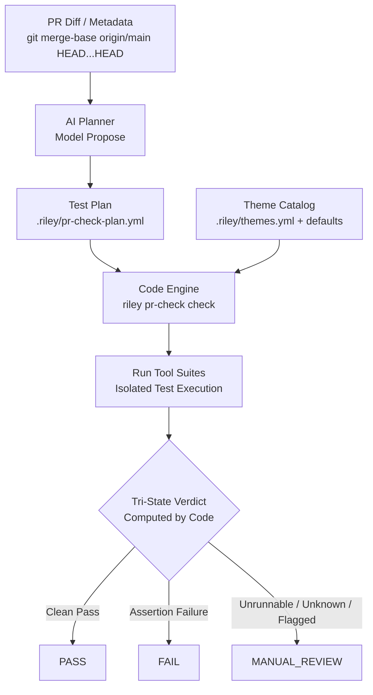

# Riley PR-Check: Generic Theme Catalog & Plan Architecture

## Overview & Mental Model

`riley pr-check` provides automated, behavioral pull-request verification for vibe coders and engineers alike.

The system is strictly divided into two distinct responsibilities:
1. **AI Job (Propose):** Reads the PR merge-base diff and description to produce a test plan (`.riley/pr-check-plan.yml`) selecting check themes and fixtures. The AI **never** evaluates test outcomes or emits verdicts.
2. **Code Job (Dispose):** Deterministic execution runner (`riley pr-check check`) that enforces baseline themes, runs selected runner tools, and calculates the tri-state verdict (`PASS`, `FAIL`, `MANUAL_REVIEW`).



Under this architecture:
- **No Self-Scoring AI:** An AI cannot mark a PR as `PASS`. Scoring is strictly derived from deterministic exit codes and assertions run by code.
- **Fail-Safe Fallbacks:** Any test theme that cannot run (e.g., missing dependencies, network down, unavailable runner) or unknown theme ID immediately produces `MANUAL_REVIEW`, never `PASS`.
- **Inviolable Baseline:** `always: true` themes are unconditionally executed by the runner, even if omitted or deleted by the AI planner.

---

## 1. Theme Concept

A **theme** is a named check family addressing a specific domain of risk or software contract. A theme is neither a product rebrand nor an ad-hoc test script; it is a cataloged inspection contract.

Standard core themes include:
- `merge-hygiene`: Fast-forward cleanliness, merge conflicts, lockfile desync, and tree cleanliness.
- `aislop`: Structural AI-slop pattern detection, comment pollution, hallucinated APIs, and stubbed logic.
- `tests-can-fail`: Mutation and sanity verification ensuring test assertions actually fail when behavior breaks.
- `authz`: Authorization, authentication boundary checks, token scope enforcement, and privilege escalation guards.
- `wire-contract`: Wire compatibility, schema migrations, protobuf/JSON envelope stability, and breaking API changes.
- `leak-lifecycle`: Resource leak prevention, goroutine/task leaks, fd exhaustion, and lifecycle cleanup (`close`/`dispose`).
- `timeout-async`: Cancellation propagation, context timeout enforcement, async race detection, and deadlocks.
- `null-vs-zero`: Semantic differentiation between absent, null, and zero-value representations.
- `sanitizer`: Memory/data sanitizer passes (AddressSanitizer, ThreadSanitizer, injection vulnerability checks).
- `k8s`: Kubernetes manifest validation, admission control compliance, RBAC, and resource limit declarations.

---

## 2. Catalog Specification (`.riley/themes.yml`)

The theme catalog can be defined at the repository level (`.riley/themes.yml`) or fall back to the built-in system defaults packaged in `riley pr-check`.

### Theme Schema Fields

| Field | Type | Required | Description |
| :--- | :--- | :--- | :--- |
| `id` | `string` | Yes | Unique identifier for the theme (e.g., `merge-hygiene`, `wire-contract`). |
| `detect` | `object` | No | Optional heuristic path globs and symbol patterns indicating when the theme is relevant. |
| `always` | `boolean` | No | If `true`, the runner always executes this theme regardless of the AI plan. Default `false`. |
| `runner` | `string` | Yes | Existing CLI tool or script to invoke (e.g., `git`, `aislop`, `vitest`, `pytest`, `go test`). |
| `if_cannot_run` | `string` | Yes | Fallback outcome if prerequisites are missing. Must be `MANUAL_REVIEW` (never skip-as-PASS). |
| `emit` | `enum` | No | Output format expected from the AI planner: `none`, `script-table`, or `test-stub`. Default `none`. |

### Example Catalog (`.riley/themes.yml`)

```yaml
version: "1.0"
themes:
  # Inviolable baseline themes (always executed)
  - id: merge-hygiene
    always: true
    runner: "riley-pr-check-runner-git"
    if_cannot_run: MANUAL_REVIEW
    emit: none

  - id: aislop
    always: true
    runner: "riley-aislop-lint"
    if_cannot_run: MANUAL_REVIEW
    emit: none

  - id: tests-can-fail
    always: true
    runner: "vitest run --testNamePattern='sanity/negative'"
    if_cannot_run: MANUAL_REVIEW
    emit: none

  # Dynamically planned themes
  - id: authz
    detect:
      paths:
        - "src/auth/**"
        - "src/server/routes/**"
      symbols:
        - "canAccess"
        - "verifyToken"
    runner: "pytest tests/security/test_authz.py"
    if_cannot_run: MANUAL_REVIEW
    emit: script-table

  - id: wire-contract
    detect:
      paths:
        - "api/**"
        - "proto/**"
        - "src/types/**"
    runner: "buf breaking --against 'origin/main'"
    if_cannot_run: MANUAL_REVIEW
    emit: none

  - id: timeout-async
    detect:
      paths:
        - "src/async/**"
        - "src/workers/**"
    runner: "go test -race -timeout 30s ./..."
    if_cannot_run: MANUAL_REVIEW
    emit: script-table

  - id: leak-lifecycle
    detect:
      paths:
        - "src/platform/**"
        - "src/daemon/**"
    runner: "npm run test:leaks"
    if_cannot_run: MANUAL_REVIEW
    emit: test-stub
```

---

## 3. AI Job: Propose Only

The AI planner operates strictly as a proposal generator:
1. **Reads Git Diff:** Evaluates `git diff $(git merge-base origin/main HEAD)...HEAD` along with the PR title and description.
2. **Selects Themes:** Evaluates which non-default themes are relevant based on changed paths, signatures, and behavioral risk.
3. **Generates Fixtures/Tables:** If a theme specifies `emit: script-table`, generates FitNesse-shaped acceptance tables (`given` / `when` / `check`).
4. **Outputs Plan File:** Writes `.riley/pr-check-plan.yml`.
5. **No Verdicts:** The model is strictly forbidden from evaluating pass/fail status or asserting acceptance outcomes.

### Plan Schema (`.riley/pr-check-plan.yml`)

```yaml
version: "1.0"
pr:
  base: "origin/main"
  head: "HEAD"
themes:
  - id: "<theme-id>"
    reason: "<concise justification for selecting this theme>"
    tables:
      - name: "<table-name>"
        scenario: "<scenario description>"
        rows:
          - given: "<precondition>"
            when: "<operation or call>"
            check: "<expected invariant or code assertion>"
```

### Example AI Plan (`.riley/pr-check-plan.yml`)

```yaml
version: "1.0"
pr:
  base: "origin/main"
  head: "c4f82e1"
themes:
  # Notice: always: true themes (merge-hygiene, aislop, tests-can-fail)
  # are injected automatically by the code runner even if omitted here.
  - id: wire-contract
    reason: "Diff modifies route handler signatures in api/v1/endpoints.go"

  - id: authz
    reason: "New permission boundary added for user impersonation"
    tables:
      - name: "Draft vs 404 Style Access Gate"
        scenario: "Verify unpublished draft access controls"
        rows:
          - given: "role: viewer, document_status: draft"
            when: "GET /api/documents/doc-101"
            check: "status == 404"
          - given: "role: editor, document_status: draft"
            when: "GET /api/documents/doc-101"
            check: "status == 200"
          - given: "role: anonymous, document_status: published"
            when: "GET /api/documents/doc-102"
            check: "status == 200"

  - id: timeout-async
    reason: "Worker queue fetcher modified with context deadline"
    tables:
      - name: "AskMeta Hop vs Hops Timeout"
        scenario: "Multi-hop gateway timeout bubbling"
        rows:
          - given: "gateway_timeout: 50ms, upstream_latency: 200ms"
            when: "dispatch_hops(hops=1)"
            check: "error == context.DeadlineExceeded"
          - given: "gateway_timeout: 200ms, upstream_latency: 50ms"
            when: "dispatch_hops(hops=3)"
            check: "error == nil"
```

---

## 4. Code Job: Dispose & Verify

The verification runner is executed deterministically:
```bash
riley pr-check check
```

### Execution Steps
1. **Catalog Load:** Resolves `.riley/themes.yml` merged over system defaults.
2. **Plan Load:** Reads `.riley/pr-check-plan.yml`.
3. **Theme Synthesis:**
   - Evaluates all `always: true` themes in the catalog. Even if the AI plan omitted `merge-hygiene`, `aislop`, or `tests-can-fail`, the runner injects them.
   - Appends all themes explicitly declared in `.riley/pr-check-plan.yml`.
4. **Validation Gates:**
   - **Unknown Theme:** If a plan lists a theme ID not present in the catalog, the runner flags the run as `MANUAL_REVIEW`.
   - **Runner Unavailability:** If a runner binary or environment dependency cannot run, `if_cannot_run: MANUAL_REVIEW` takes effect immediately. It **never** treats an unrunnable check as a `PASS`.
5. **Execution & Table Driving:**
   - Executes each theme's defined `runner`.
   - For themes with `script-table` definitions, the runner feeds rows into the target fixture harness and validates assertions.
6. **Verdict Resolution:**
   - All runners exit `0` and all table assertions hold $\rightarrow$ `PASS`.
   - Any runner exits non-zero or table assertion fails $\rightarrow$ `FAIL`.
   - Any unrunnable runner, missing dependency, or unknown theme $\rightarrow$ `MANUAL_REVIEW`.

---

## 5. Universal Repo Adaptability

The catalog is designed to fit any repository out of the box with zero boilerplate:

- **Default Packaged Catalog:** Provides immediate protection using universal tools (`git`, AST linters, isolation test runners).
- **Domain Specialization via Repo Override:** Repositories extend or customize themes by dropping a `.riley/themes.yml` into their root:
  - **Grafana-style API:** Adds `wire-contract`, `authz`, `sanitizer`, `0-hop-gateway`.
  - **Orca Desktop/Runtime:** Adds `leak-lifecycle`, `cgroup-sandbox`, `pnp-filter`.
  - **Kubernetes Operators:** Adds `k8s-admission`, `crd-validation`, `controller-reconcile`.

By maintaining a clear division between AI planning and deterministic code execution, `riley pr-check` prevents silent test evasion while enabling dynamic, context-aware PR verification.
