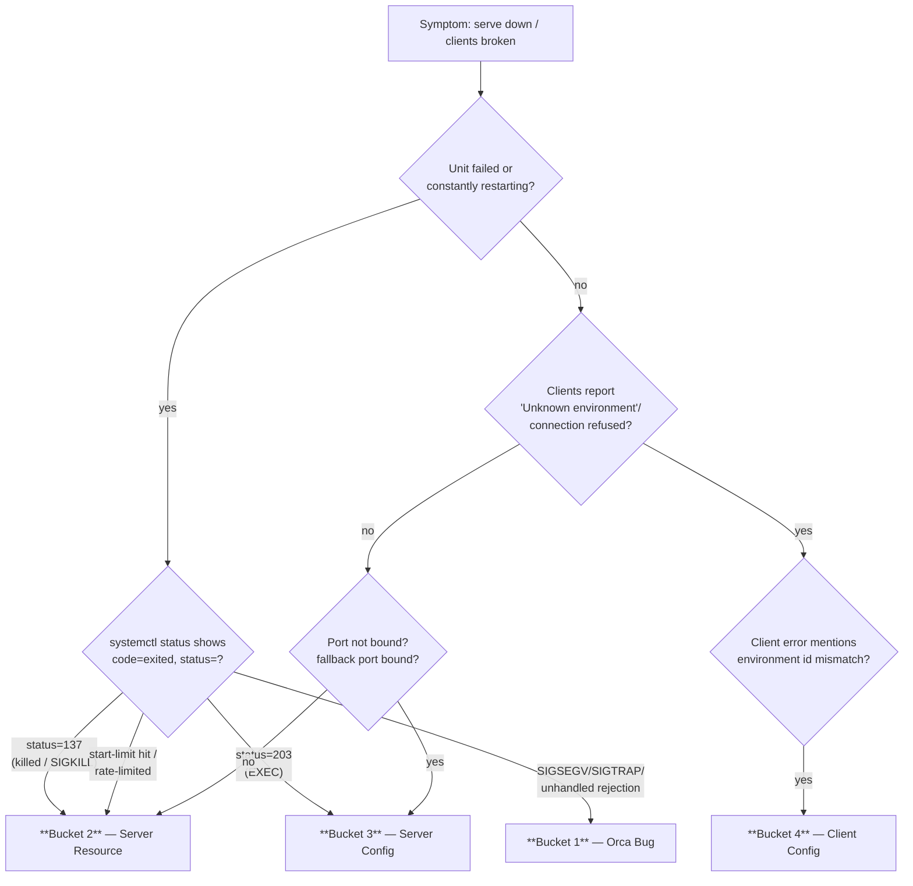

# Orca Serve Troubleshooting Matrix

Triaging the headless `orca serve` runtime from symptom to root cause. Every failure lands in
exactly one of four buckets; the hard part is picking the right bucket before you reach for a
fix. Start at the flowchart, then read that bucket's table and run its **≤ 5**-command cheat
sheet. Evidence before remedies: capture the journal and status first, then act.

---

## 1. Decision flowchart



ASCII fallback (same routing):

```text
 serve down / clients broken
        │
        ├─ unit failed / restart-looping ──► status=137 ────────────► BUCKET 2 (resource)
        │                                   status=203 (EXEC) ─────► BUCKET 3 (server config)
        │                                   SIGSEGV/SIGTRAP /
        │                                   unhandled rejection ────► BUCKET 1 (orca bug)
        │                                   start-limit hit ───────► BUCKET 2 (resource)
        │
        └─ clients "Unknown environment" / "connection refused"
                │
                ├─ environment-id mismatch ──► BUCKET 4 (client config)
                ├─ pinned port not bound /
                │   fallback bound          ──► BUCKET 3 (server config)
                └─ OOM / ENOSPC / fd        ──► BUCKET 2 (resource)
```

**Cross-bucket discriminator (5 questions):**

| # | Question | Points to |
|---|----------|-----------|
| 1 | Does `systemctl status orca-serve@<instance>` show `status=137` (`n/a` or 128+9)? | **2** — OOM-kill |
| 2 | Does it show `status=203` (`Failed at step EXEC`)? | **3** — exec/path/permission |
| 3 | Is the pinned port LISTENing, or is a fallback port bound instead? | **3** — port/override |
| 4 | Does the journal carry `SIGSEGV`, `SIGTRAP`, `UnhandledPromiseRejection`, `RuntimeEnvironmentStoreError`? | **1** — in-process bug |
| 5 | Does the client error name an environment id not in the registry, or a stale runtimeId? | **4** — client state |

---

## 2. Bucket 1 — Orca bug (in-process)

Faults *inside* the Electron/TS runtime itself. You cannot fix these with config or resources;
you pin the build, capture the journal, and fix upstream.

| Signature | Root cause | Evidence to collect |
|-----------|-----------|---------------------|
| **SIGSEGV** in main process | Native crash — most common: headless path self-spawns Xvfb on a stale `:99` lock, a GPU-less host, or a native module | `journalctl` SIGSEGV signature, crashpad minidumps, `crash-reports.json` |
| **SIGTRAP** | WebGL2/GPU blocklisted, renderer gone — GPU-less host, or wrong DISPLAY wiring | `journalctl` SIGTRAP / WebGL2 blocklist signature, serve log tail |
| **Unhandled rejection** | `UnhandledPromiseRejectionWarning` / uncaught exception in TS — restarts never converge | journal `UnhandledPromiseRejection` / `uncaughtException` signatures |
| **`RuntimeEnvironmentStoreError` / "Unknown environment"** | Runtime identity churned and `orca-runtime.json` points at a phantom/dead pid; CLI resolves an env id with no live runtime | journal error count, `orca-runtime.json` pid vs `ss` listener |
| **Deadlocks / state churn** | daemon-init vs serve race; a runtimeId minted anew on every restart while a client pins the old one | restart count vs start-limit, journal before/after |

**Remediation (in order):** (1) capture the journal and status before/after and read the delta
("did the runtime identity, port, or crash signature change across the restart?"); (2)
reproduce on a spare instance at the same build; (3) pin or roll back the suspect build via
`ORCA_VERSION`; (4) fix upstream. Never hand-edit `orca-runtime.json` to "unphantasm" it —
that masks, not fixes.

**Triage cheat sheet (5):**

```bash
systemctl status orca-serve@<instance>.service --no-pager                 # active vs 137/203
journalctl -u orca-serve@<instance>.service -b -o cat --no-pager \
  | grep -iE 'SIGSEGV|SIGTRAP|UnhandledPromiseRejection|uncaughtException|RuntimeEnvironmentStoreError'
ss -ltnp | grep -E ':(6768|6769|6770|6771)'                                # who actually LISTENs
orca --environment <id> status --json | jq '.runtime | {runtimeId, reachable, appVersion}'
cat "${ORCA_USER_DATA_PATH:-$HOME/.config/orca}/orca-runtime.json" | jq '{runtimeId, pid}'
```

---

## 3. Bucket 2 — Server resource

The box (or its cgroup) ran out of a finite resource. The serve usually *was* healthy; the
kernel or systemd killed it.

| Signature | Root cause | Evidence to collect |
|-----------|-----------|---------------------|
| **Exit 137 / `status=137` / OOM killer** | cgroup memory limit hit (systemd) or host OOM — kernel sends SIGKILL (128+9); Electron never logs it itself | `systemctl status` result code, `journalctl -k | grep -i oom`, `coredumpctl`, memory usage |
| **`ENOSPC` (no space left)** | A data volume or `/tmp` full — AppImage self-extract or session writes fail. Never put log/state under a small `/tmp` fs | `df -h` free space on `/`, `/tmp`, and the data volume |
| **`EMFILE` (too many open files)** | fd exhaustion — fd leak in a plugin/pty loop, or `LimitNOFILE` too low vs session count | `ls /proc/<pid>/fd | wc -l`, `lsof -p <pid>` |
| **CPU starvation** | Pegged cores — runaway renderer/pty loop, or WSL2 `autoMemoryReclaim`/tight slab reclaim; startup TLS/timeout failures | `uptime` loadavg vs `nproc`, `top -bn1`, `pidstat` |

**Remediation (in order):** (1) confirm the resource (free space / fd / loadavg) and trend
over time; (2) raise the systemd **resource limits** in the unit (see template's
`MemoryHigh`/`MemoryMax`/`LimitNOFILE` — then `daemon-reload` + restart); (3) free the
exhausted resource (prune logs, purge a dead `/tmp` extraction, close leaked fds); (4) if the
killer is the cgroup, tune `MemoryMax` up or fix the leak, don't just crank the limit.

**Triage cheat sheet (5):**

```bash
systemctl status orca-serve@<instance>.service | sed -n 's/.*status=//p'    # 137/203/…
journalctl -k --since "1 hour ago" -o cat | grep -iE 'oom|killed process'
df -h /tmp / && free -h                                                    # ENOSPC / memory pressure
ls /proc/$(ss -ltnp | sed -n 's/.*pid=\([0-9]*\).*/\1/p' | head -1)/fd 2>/dev/null | wc -l
systemctl show -p MemoryCurrent -p MemoryMax -p NRestarts orca-serve@<instance>.service
```

---

## 4. Bucket 3 — Server configuration

The unit or its config is wrong: exec fails before the process starts, the port is stolen, or
permission/path denies the start.

| Signature | Root cause | Evidence to collect |
|-----------|-----------|---------------------|
| **Exit 203 / `Failed at step EXEC`** | `ExecStart` binary missing/unexecutable, bad `WorkingDirectory`, missing mount, or a needed `PATH` entry missing | `systemctl status` exec line, `journalctl -u … -b -o cat`, `systemd-analyze verify` |
| **Port collision** | Another process already LISTENs on the pinned port (dual-serve/split-brain), or an EADDRINUSE at startup | `ss -ltnp | grep <port>`, the serve journal's EADDRINUSE signature |
| **`mobile-ws-fallback-port.json` stale override** | A persisted fallback port file is bound *before* the pinned `--port`, so serve binds the remembered port and never the pin | `ls -la "$ORCA_USER_DATA_PATH/mobile-ws-fallback-port.json"` |
| **Permission denied** | `User=`/`Group=` mismatch, a dir owned by another uid, or a non-executable `ExecStart` | `journalctl -u … | grep -iE 'permission denied|operation not permitted'`, `namei -l <path>` |
| **Misconfig fail-loud** | A referenced `EnvironmentFile` is missing → unit fails loudly (no leading `-`) rather than a silent default | `systemctl status` + `journalctl`, `grep EnvironmentFile= orca-serve@.service` |

**Remediation (in order):** (1) fix the exec/path/mount cause (`203`), do not band-aid with
`Restart=always`; (2) when using `serve --port`, the pinned port is preferred over any stale
fallback (`preferPinnedPort`, issue #8535) — if the pin is still pre-empted, remove the stale
`mobile-ws-fallback-port.json` and restart; (3) resolve the port contender (kill the stray
listener, or move the instance's `--port`); (4) correct ownership/permissions and re-verify
with `systemd-analyze verify` before `daemon-reload`.

**Triage cheat sheet (5):**

```bash
systemctl status orca-serve@<instance>.service --no-pager -l | tail -20       # 203 / EXEC / permission
ss -ltnp | grep -E ':(6768|6769|6770|6771)'                                    # who owns the port
ls -la "${ORCA_USER_DATA_PATH:-$HOME/.config/orca}/mobile-ws-fallback-port.json" 2>/dev/null \
  && cat "${ORCA_USER_DATA_PATH:-$HOME/.config/orca}/mobile-ws-fallback-port.json" # stale override?
systemd-analyze verify /etc/systemd/system/orca-serve@.service                # pre-reload syntax gate
namei -l "$(systemctl cat orca-serve@<instance>.service 2>/dev/null | sed -n 's/^ExecStart=//p' | awk '{print $1}')"
```

---

## 5. Bucket 4 — Client configuration

The serve is healthy (bound, LISTENing); the *client* cannot resolve, reach, or authenticate
to it.

| Signature | Root cause | Evidence to collect |
|-----------|-----------|---------------------|
| **"Unknown environment: \<id\>"** | Client environment id (registry `name`) has no matching live runtime — served env-id unset/blank, or the selector stripped/mismatched on a local CLI call | client stderr, `--environment` flag, environment registry on the client, serve-side journal |
| **Connection refused** | Wrong host/port, overlay IP unreachable, `localhostForwarding` off in WSL2, or serve not actually bound to the expected address | `nc -zv <addr> <port>`, `ss -ltn` on serve host vs advertised pairing address |
| **Token mismatch** | Device token / E2EE keypair on one side ≠ other side (re-paired or a restored-from-stale-backup keypair) | pair logs on both ends, presence of `orca-e2ee-keypair.json` vs its backup copy |
| **Stale pairing id / `activeRuntimeEnvironmentId`** | Restart minted a **new runtimeId**; client still pins the old id and never detects the change — classic orphan-until-relaunch | `orca-runtime.json` runtimeId change across restart, client "disconnected, retrying" stuck state |
| **Version skew** | Client/serve different protocol versions — daemon-init `killStaleDaemon` vs newer runtime, or flag/transport contract drift | `orca --version` on client vs the serve's `ORCA_VERSION`, protocol handshake rejection in logs |

**Remediation (in order):** (1) verify the transport ends (address, port, reachability)
before auth — most "connection refused" is network, not token; (2) reconcile environment id +
pairing address between client registry and serve (`ORCA_ENVIRONMENT` / `--pairing-address`);
(3) if the runtimeId changed under a pinned client, relaunch the client (or fix the stale-id
reconnect bug) — keypair/token usually persist so this is a session rebuild, not a re-pair;
(4) align client/serve versions.

**Triage cheat sheet (5):**

```bash
nc -zv <pairing-address> <port>                                              # transport reachability
orca --environment <id> status --json | jq '.runtime | {runtimeId, appVersion, reachable}'
cat "${ORCA_USER_DATA_PATH:-$HOME/.config/orca}/orca-runtime.json" | jq '{runtimeId, pid}'
orca --version                                                               # client build vs serve ORCA_VERSION
cmp "$HOME/.config/orca/orca-e2ee-keypair.json" "$BACKUP/orca-e2ee-keypair.json" && echo matched
```

---

## 6. Evidence-first checklist

Before any remedy, capture status and the journal and read the delta — it answers "did the
runtime identity, port, or crash signature change across the restart?".

```bash
# 1. snapshot the runtime now
orca --environment <id> status --json > /tmp/orca-status-now.json
# 2. the serve's own words since boot
journalctl -u orca-serve@<instance>.service -b -o cat --no-pager > /tmp/orca-serve-journal.txt
# 3. crash + resource signals in one grep
grep -iE 'SIGSEGV|SIGTRAP|SIGKILL|Unhandled|uncaught|oom|killed process' /tmp/orca-serve-journal.txt
```
